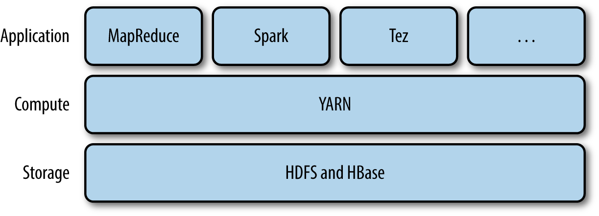
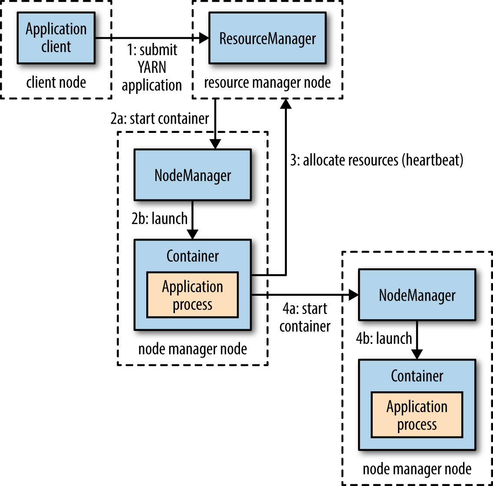
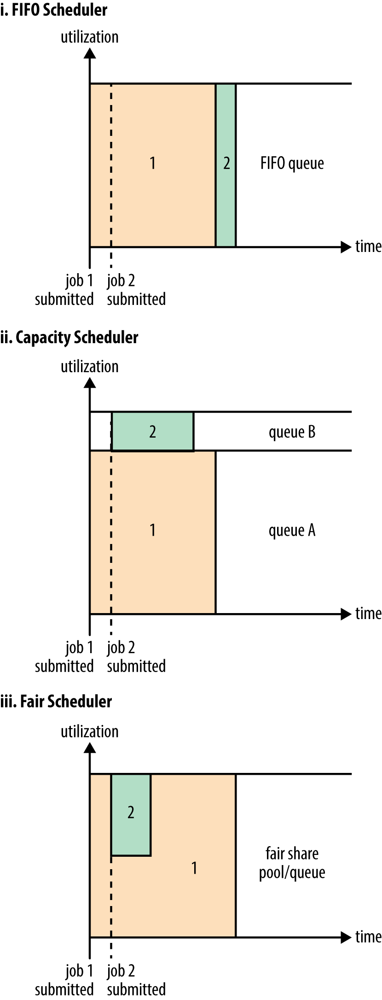

# Apache YARN 

* (Yet Another Resource Negotiator)

* distributed computing frameworks (MapReduce, Spark, and so on) running as YARN applications on the cluster compute layer (YARN) and the cluster storage layer (HDFS and HBase).

* Pig, Hive, and Crunch are all examples of processing frameworks that run on MapReduce, Spark, or Tez (or on all three), and don’t interact with YARN directly.

## How YARN runs

Two types of long-running daemon: 

* a **resource manager (one per cluster)** to manage the use of resources across the cluster, 
* **node managers** running on all the nodes in the cluster to launch and monitor **containers**

A container executes an application-specific process with a constrained set of resources (memory, CPU, and so on).
Precisely what the application master does once it is running depends on the application.

### Resource Requests
A request for a set of containers can express the amount of computer resources required for each container (memory and CPU), as well as locality constraints for the containers in that request.

// TODO

### Scheduling in YARN

* YARN provides a choice of schedulers and configurable policies
* FIFO
    * FIFO Scheduler places applications in a queue and runs them in the order of submission (first in, first out). Requests for the first application in the queue are allocated first
    * not suitable for shared clusters
    * On a shared cluster it is better to use the Capacity Scheduler or the Fair Scheduler.
* Capacity
    * a separate dedicated queue allows the small job to start as soon as it is submitted, although this is at the cost of overall cluster utilization since the queue capacity is reserved for jobs in that queue
* Fair Schedulers
    * no need to reserve a set amount of capacity, since it will dynamically balance resources between all running jobs
        * Just after the first (large) job starts, it is the only job running, so it gets all the resources in the cluster. 
        * When the second (small) job starts, it is allocated half of the cluster resources so that each job is using its fair share of resources.
    * a lag between the time the second job starts and when it receives its fair share
    * The overall effect is both high cluster utilization and timely small job completion.
    

### Delay Scheduling

* All the YARN schedulers try to honor **locality requests**
* However, it has been observed in practice that waiting a short time (no more than a few seconds) can dramatically increase the chances of being allocated a container on the requested node, and therefore increase the efficiency of the cluster
* delay scheduling, and it is supported by both the Capacity Scheduler and the Fair Scheduler

* Every node manager in a YARN cluster periodically sends a heartbeat request to the resource manager—by default, one per second. Heartbeats carry information about the node manager’s running containers and the resources available for new containers, so each heartbeat is a potential scheduling opportunity for an application to run a container.
* When using delay scheduling, the scheduler doesn’t simply use the first scheduling opportunity it receives, but _waits for up to a given maximum number of scheduling opportunities to occur before loosening the locality constraint and taking the next scheduling opportunity._
* `yarn.scheduler.capacity.node-locality-delay` and ``

### Dominant Resource Fairness

* YARN address allocation fairness problem is to look at **each user’s dominant resource and use it as a measure of the cluster usage**. This approach is called Dominant Resource Fairness, or DRF for short
* memory is dominant since its proportion (3%) is larger than CPU’s (2%) ?
* By default DRF is not used, so during resource calculations, only memory is considered and CPU is ignored
