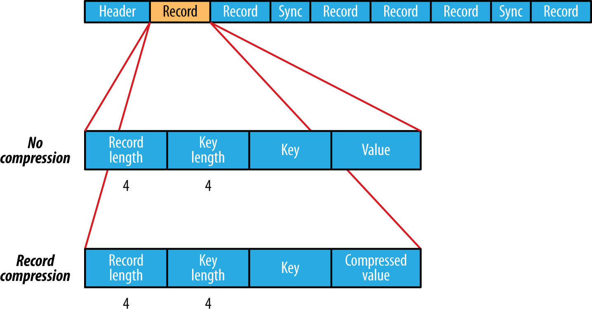
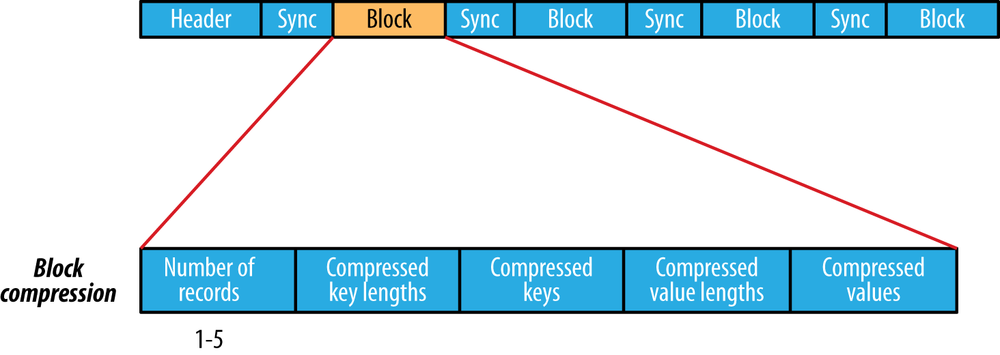

## Data Integrity

* because every I/O operation on the disk or network carries with it a small chance of introducing errors into the data that it is reading or writing, when the volumes of data flowing through the system are as large as the ones Hadoop is capable of handling, the chance of data corruption occurring is high.
* The usual way of detecting corrupted data is by computing a checksum for the data when it first enters the system, and again whenever it is transmitted across a channel that is unreliable and hence capable of corrupting the data.
* it is **merely error detection**. (And this is a reason for not using low-end hardware; in particular, be sure to use ECC memory
* it is possible that it’s the checksum that is corrupt, not the data, but this is very unlikely, because the checksum is much smaller than the data.
* CRC-32 (32-bit cyclic redundancy check), which computes a 32-bit integer checksum for input of any size

## Data Integrity in HDFS

* HDFS transparently checksums all data written to it and by default verifies checksums when reading data.
* A separate checksum is created for every `dfs.bytes-per-checksum` bytes of data. 
* The default is 512 bytes, and because a CRC-32C checksum is 4 bytes long, the storage overhead is less than 1%
* Datanodes are responsible for verifying the data they receive before storing the data and its checks
* A client writing data sends it to a pipeline of datanodes (as explained in Chapter 3), and **the last datanode in the pipeline verifies the checksum.** If the datanode detects an error, the client receives a subclass of IOException, which it should handle in an application-specific manner (for example, by retrying the operation).
* When clients read data from datanodes, they verify checksums as well, comparing them with the ones stored at the datanodes.
* When a client successfully verifies a block, it tells the datanode, which updates its log. Keeping statistics such as these is valuable in detecting bad disks.
* each datanode runs a **DataBlockScanner** in a background thread
* if a client detects an error when reading a block, it reports the bad block and the datanode it was trying to read from to the namenode before throwing a `ChecksumException`. Namenode then schedules a copy of the block to be replicated on another datanode, so its **replication factor** is back at the expected level. Once this has happened, the corrupt replica is deleted.
* We can also disable the checksum.
    * `FileSystem.setVerifyChecksum()`
    * `hdfs dfs -get -ignoreCrc ...`
* `hadoop fs -checksum` to check if 2 files are of same content, which `distcp` does

## Compression

* `bzip2` are splitable
* `LZO` files are splittable if they have been indexed in a preprocessing step
* **Splitable**: the compression format supports splitting (that is, whether you can seek to any point in the stream and start reading from some point further on)
* A **codec** is the implementation of a compression-decompression algorithm

* MapReduce will do the right thing and not try to split the gzipped file
* This will work, but at the expense of locality: a single map will process the eight HDFS blocks, most of which will not be local to the map.
* it is possible to preprocess LZO files using an indexer tool that comes with the Hadoop LZO libraries
* if your input files are compressed, they will be decompressed automatically as they are read by MapReduce, using the filename extension to determine which codec to use.

* For sequence file compression type, The default is RECORD, which compresses individual records. Changing this to BLOCK, which compresses groups of records, is recommended because it compresses better

## Serialization

* In Hadoop, interprocess communication between nodes in the system is implemented using remote procedure calls (RPCs).
* Hadoop uses its own serialization format, `Writables`, which is certainly compact and fast, but not so easy to extend or use from languages other than Java
* Avro (a serialization system that was designed to overcome some of the limitations of Writables)
* The bytes are written in **big-endian order** (so the most significant byte is written to the stream first, which is dictated by the java.io.DataOutput interface), and we can see their hexadecimal representation by using a method on Hadoop’s StringUtils:
* Advantages of variable length `VIntWritable` and `VLongWritable`
    * values is fairly uniform across the whole value space, such as when using a (well-designed) hash function. Most numeric variables tend to have nonuniform distributions, though, and on average, the variablelength encoding will save space. 
    * Another advantage of variable-length encodings is that you can switch from VIntWritable to VLongWritable, because their encodings are actually the same.
* Text is a Writable for UTF-8 sequences. 
* Text is mutable (like all Writable implementations in Hadoop, except NullWritable, which is a singleton
* BytesWritable is a wrapper for an array of binary data. Its serialized format is a 4-byte integer field that specifies the number of bytes to follow, followed by the bytes themselves.
* BytesWritable is mutable
* `NullWritable` is a special type of Writable, as it has a zero-length serialization. No bytes are written to or read from the stream. It is used as a placeholder;

## Serialization frameworks

* only Writable or Avro objects can be serialized or deserialized out of the box.
* Hadoop includes a class called JavaSerialization that uses Java Object Serialization.
    * Java Serialization doesn’t meet the criteria for a serialization format listed earlier: compact, fast, extensible, and interoperable.
* Serialization IDL
    * a language neutral, declarative fashion, using an interface description language (IDL)
    * versioning schemes that make type evolution straightforward.
    * Apache Thrift and Google Protocol Buffers
        * a format for persistent binary data
        
        
## SequenceFile

* a persistent data structure for binary key-value pairs
* example log format `<LongWritable (key, timestamp), Writable(log content)>`
* A sync point is a point in the stream that can be used to resynchronize with a record boundary if the reader is “lost”
* SequenceFile.Writer, which inserts a special entry to mark the sync point every few records as a sequence file is being written
* The `sync(long position)` method on SequenceFile.Reader positions the reader at the next sync point after position.
* A sequence file consists of a header followed by one or more records, first 3 bytes are SEQ, which act as a magic number

* If no compression is enabled (the default), each record is made up of the record length (in bytes), the key length, the key, and then the value.
* The format for record compression is almost identical to that for no compression, except the value bytes are compressed using the codec defined in the header. Note that keys are not compressed.