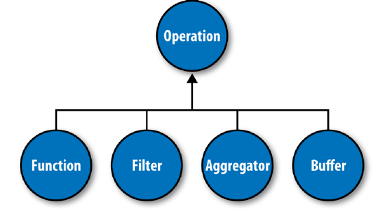

# Cascading

* Map and reduce operations offer powerful primitives.
* Cascading departs from map and reduce operations directly by introducing higher-level abstractions as alternatives: **Functions, Filters, Aggregators, and Buffers**.
* in several other MapReduce tools, you must preformat, filter, or import your data into HDFS prior to running the application
* Cascading provides the means to prepare and manage your data as integral parts of the programming abstraction.

[Cascading User Guide](http://www.cascading.org/documentation/)

In the abstract, keys and values not only bind map to reduce, but reduce to the next map, and then to the next reduce, and so on. key-value pairs are sourced from input files and stream through chains of map and reduce operations, and finally rest in an output file.

Cascading simplifies this by abstracting away keys and values and replacing them with tuples that have corresponding field names. During processing, streams of these fields and tuples are then manipulated as they pass through user-defined operations linked together by **pipes**

All these pipes are chained together by the developer into “**pipe assemblies**,” in which each assembly can have many input tuple streams (**sources**) and many output tuple streams (**sinks**).

## Operations

... 

**Buffer**
A Buffer is similar to an Aggregator, except it is optimized to act as a “sliding window” across all the tuples in a unique grouping. 

Operations are bound to pipes when the pipe assembly is created

The Each and Every pipes provide a simple mechanism for selecting some or all values out of an input tuple before the values are passed to its child operation

## Taps, Schemes, and Flows

In Cascading, all data is read from or written to **Tap** instances (source/sink), but is converted to and from tuple instances via `Scheme` objects

**Tap**
A Tap is responsible for the “how” and “where” parts of accessing data.

**Schema**
A Scheme is responsible for reading raw data and converting it to a tuple and/or writing a tuple out into raw data

**Flow**
When a pipe assembly is connected with the necessary number of _source and sink Tap instances_, we get a Flow.
If you think of a pipe assembly like a Java class, then a Flow is like a Java object instance 

So **pipe assemblies are really data process definition**s, and are not “executable” on their own. **They must be connected to source and sink `Tap` instances** before they can run on a cluster.

