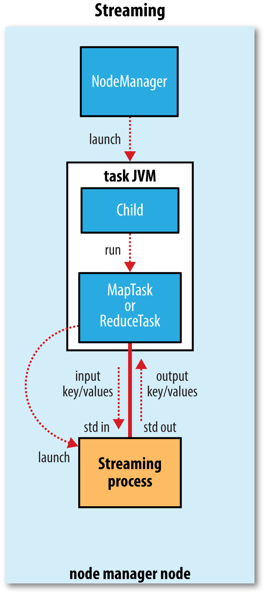

## MapReduce Run

* You can run a MapReduce job with a single method call
    * call: `submit()` on a Job object, which return immediately
    * you can also call waitForCompletion(), which submits the job if it hasn’t been submitted already, then waits for it to finish
    

### Speculative Execution

* This makes the _job execution time sensitive to slow-running tasks_, as it takes only one slow task to make the whole job take significantly longer than it would have done otherwise
* Hadoop doesn’t try to diagnose and fix slow-running tasks; instead, it tries to detect when a task is running slower than expected and launches another equivalent task as a backup.
* the scheduler tracks the progress of all tasks of the same type (map and reduce) in a job, and only launches speculative duplicates for the small proportion that are running significantly slower than the average
* Speculative execution is an _optimization_, and not a feature to make jobs run more reliably
* The same bugs are likely to affect the speculative task.
* Speculative execution is turned on by default.
* The goal of speculative execution is to reduce job execution time, but this comes **at the cost of cluster efficiency**. On a busy cluster, speculative execution can reduce overall throughput
* some cluster administrators prefer to turn it off on the cluster and have users explicitly turn it on for individual jobs.
* **turning off speculative execution for reduce tasks**, since any duplicate reduce tasks have to fetch the same map outputs as the original task, and this can significantly increase network traffic on the cluster.
* Another reason for turning off speculative execution is for nonidempotent tasks
    * However, in many cases it is possible to write tasks to be idempotent and use an OutputCommitter to promote the output to its final location when the task succeeds.
    

### Commit protocol

* The framework ensures that in the event of multiple task attempts for a particular task, only one will be committed

#### Task side-effect files

* more flexibility than a single keyvalue pair model, so these applications write output files directly from the map or reduce task
* Care needs to be taken to ensure that multiple instances of the same task don’t try to write to the same file
* **`OutputCommitter`** protocol solves this
* If applications write side files in their tasks’ working directories, the side files for tasks that successfully complete will be promoted to the output directory automatically, whereas failed tasks will have their side files deleted.
* If a map task writes the converted images into its working directory, they will be promoted to the output directory when the task successfully finishes
