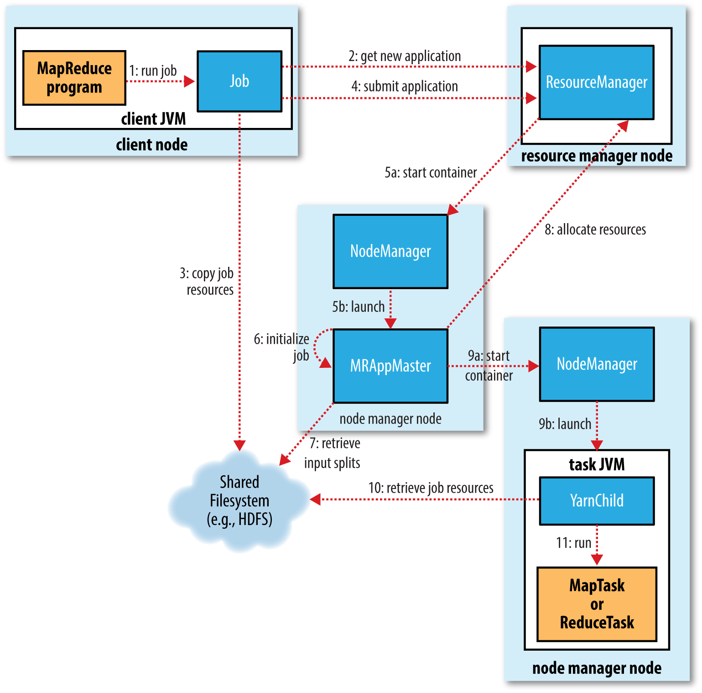

## MapReduce Run

* You can run a MapReduce job with a single method call
    * call: `submit()` on a Job object, which return immediately
    * you can also call waitForCompletion(), which submits the job if it hasn’t been submitted already, then waits for it to finish
    

