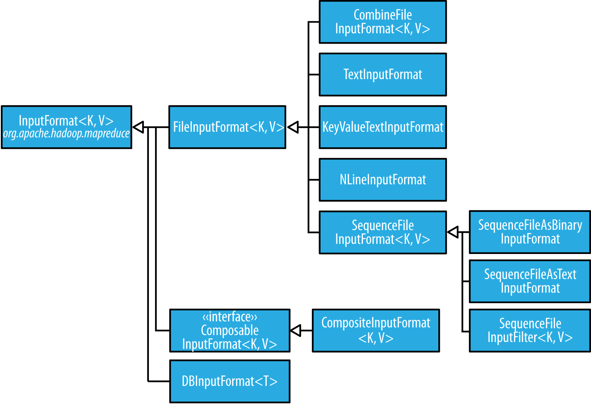

## MapReduce Types

```java
map: (K1, V1) → list(K2, V2)
partition: (K2, V2) → integer
combiner: (K2, list(V2)) -> list(K2, V2)
reduce: (K2, list(V2)) → list(K3, V3)
```
* the reduce input must have the same types as the map output
* default map and reduce functions are both identity functions, which by definition preserve type
* Records are sorted by the MapReduce system before being presented to the reducer. In this case, the keys are sorted numerically
* The default output format is TextOutputFormat, which writes out records, one per line, by converting keys and values to strings and separating them with a tab character


## Numbers of Map tasks and Reduce tasks

* we didn’t set the number of map tasks. The reason for this is that the number is equal to the number of splits that the input is turned into, which is driven by the size of the input and the file’s block size (if the file is in HDFS)
* The single reducer default 
* One rule of thumb is to aim for reducers that each run for five minutes or so, and which produce at least one HDFS block’s worth of output.


## Input Formats

* an input split is a chunk of the input that is processed by a single map.
* Each map processes a single split.
* Each split is divided into records, and the map processes each record—a key-value pair—in turn
* `DBInputFormat`: In a database context, a split might correspond to a range of rows from a table and a record to a row in that range
* a split doesn’t contain the input data; it is just a **reference** to the data.
* an `InputFormat` is responsible for creating the input splits and dividing them into records



* A path may represent a file, a directory, or, by using a glob, a collection of files and directories

### MultithreadedMapper

* for mappers that spend a long time processing each record —because they contact external servers, for example—it allows multiple mappers to run in one JVM with little contention.