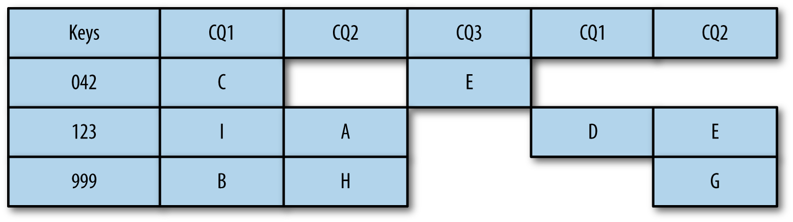
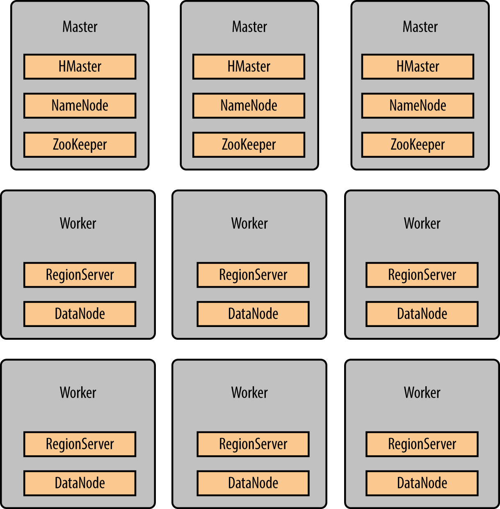

## Table Format

* HBase introduces the concept of **column families**
* System tables
* User tables (default namespace by default)

## Table Layout

* An HBase table is composed of **one or more column families (CFs)**, containing columns (which we will call **columns qualifiers,** or CQ for short) where **values can be stored**.
* HBase tables may be sparsely populated—some columns might not contain a value at all.
    * There is **no null value stored** in anticipation of a future value being stored. Instead, **that column for that particular row key simply does not get added to the table**. 


> a row is formed of multiple columns, all referenced by
  the same key. **A specific column and a key are called a cell**. It is possible
  to have **multiple versions of the same cell**, all differentiated by
  the **timestamp**. A cell can also be called a **KeyValue pair**. So a row,
  referenced by a key, is formed of a group of cells, each being a specific
  column for the given row.

* Only columns where there is a value are stored in the underlying filesystem
* Columns can be dynamically generated as data is inserted into the column family.
* it is possible to have millions of columns with dynamically created names, where columns names are different between all the rows.
* To allow a faster lookup access, **keys and columns are alphabetically sorted within a table but also in memory**.
* HBase orders the keys based on the byte values, “1234” will come before “9”.
* If you have to store numbers, then to **save on space and to keep the ordering, you will need to store their byte representation**.
* they will be used to create files and directories in the filesystem, the table name and the column family names need to use only printable characters.



## Table Storage
* a table is composed of one to many regions, composed of one to many column families, composed of a single store, composed of a unique memstore plus one to many HFiles, composed of blocks composed of cells.
* On a RegionServer, you will have as many **memstores as you have regions multiplied by the number of column families receiving writes,** all sharing the same reserved memory area.

## Regions

* tables are split into regions where each region will store a specific range of data.
* The regions are assigned to **RegionServers** to serve each region’s content. * When they become too big, regions can be split. They can also be merged if required.
* Each region will have a start key and an end key that will define its boundaries.
* All this information will be stored within the files into the region but also into the hbase:meta table
* When they become too big, regions can be split. They can also be merged if required.

## Column family

* For the same region, different column families will store the data into different files and can be configured differently. **Data with the same access pattern and the same format should be grouped into the same column family**.


## Stores
* one store per column family. A store object regroups one memstore and zero or more store files (called HFiles).


## HFiles
* HFiles are created when the memstores are full and must be flushed to disk. HFiles are eventually compacted together over time into bigger files.
* HFiles are composed of different types of blocks (e.g., **index blocks and data blocks)**. HFiles are stored in HDFS, so they benefit from Hadoop persistence and replication.


## HBase Roles

* HBase also relies on ZooKeeper to monitor the health of its servers,
* There is work in progress in HBase 2.0 to reduce its dependency on ZooKeeper.
* Recent HDFS versions allow more than two NameNodes



## Master Server

* only a single master will be active at a time
* HBase Master doesn’t have much workload and can be installed on servers with less memory and fewer cores
* HBase Master doesn’t have much workload and can be installed on servers with less memory and fewer cores
* it is best to build more robust HBase Masters (NameNodes, ZK etc. master services) OS on RAID drives, dual power supply
* A cluster can survive without a master server as long as there is no RegionServer failing nor regions splitting


## Region Server

* When required (e.g., to read and write data into a specific region), calls from the Java API can go directly to the RegionServer
* A RegionServer will decide and handle the splits and the compactions but will report the events to the master. HMaster only monitoring the completion of this
* When a client tries to read data from HBase for the first time, it will first go to ZooKeeper to find the master server and locate the hbase:meta region where it will locate the region and RegionServer it is looking for. In subsequent calls from the same client to the same region, all those extra calls are skipped, and the client will talk directly with the related RS.
* Unlike the Java client that can talk to any RegionServer, a C/C++ client using a Thrift server can talk only to the Thrift server.

## Try REST server

```bash
create 't1', 'f1'
put 't1', 'r1', 'f1:c1', 'val1'
curl -H "Accept: text/xml" http://localhost:8080/t1/r1/f1:c1
$ echo "dmFsMQ==" | base64 -d
curl -H "Accept: application/octet-stream" http://localhost:8080/t1/r1/f1:c1
```