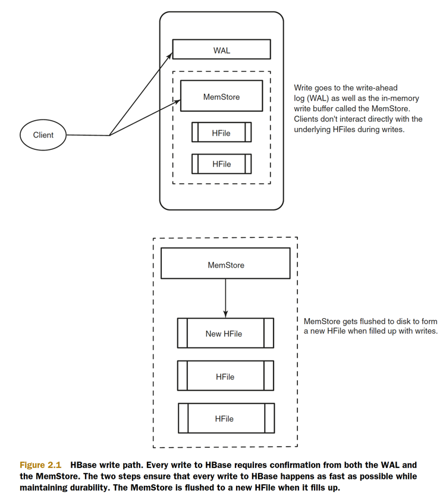

## logical data model

```bash
# create users table with info CF & default parameters
create 'users', 'info

hbase(main):011:0> describe 'users'
Table users is ENABLED                                                                                                                                                              
users                                                                                                                                                                               
COLUMN FAMILIES DESCRIPTION                                                                                                                                                         
{NAME => 'info', BLOOMFILTER => 'ROW', VERSIONS => '1', IN_MEMORY => 'false', KEEP_DELETED_CELLS => 'FALSE', DATA_BLOCK_ENCODING => 'NONE', TTL => 'FOREVER', COMPRESSION => 'NONE',
 MIN_VERSIONS => '0', BLOCKCACHE => 'true', BLOCKSIZE => '65536', REPLICATION_SCOPE => '0'}                                                                                         
1 row(s) in 0.0280 seconds
```

* Columns in HBase are organized into groups called column families
* A table in HBase must have at least one column family
* column families impact physical characteristics of the data store in HBase
* the table creation didn’t involve any columns or types. Other than the column family name,
* Every row in an HBase table has a unique identifier called its **rowkey**.
* rowkey values are distinct across all rows in an HBase table.
* All data in HBase is stored as raw data in the form of a byte array (`Bytes.toBytes(...)`), and that includes the rowkeys
* The rowkey is the first coordinate, followed by the column family. The next coordinate is the column qualifier, often called simply column, or qual,
* Because HBase is schema-less, you never need to predefine the column qualifiers or assign them types.
    * These three coordinates define the location of a cell. The cell is where HBase stores data as a value. A cell is identified by its `[rowkey, column family, column qualifier]` coordinate within a
      table. 
* They’re dynamic; all you need is a name that you give them at write time.
* Changing data in HBase is done the same way you store new data:

### the HBase write path

* When a write is made, by default, it goes into two places: **the write-ahead log (WAL), also referred to as the HLog, and the MemStore**
* Only after the change is written to and confirmed in both places is the write considered complete.
* The MemStore is a write buffer where HBase accumulates data in memory before a permanent write.
* Its contents are flushed to disk to form an HFile when the MemStore fills up. It doesn’t write to an existing HFile but instead forms a new file on every flush. 
* The HFile is the underlying storage format for HBase.
* HFiles belong to a column family, and a column family can have multiple HFiles.
* one MemStore per column family
* HBase safeguards against that by writing to the WAL before the write completes. Every server that’s part of the HBase cluster keeps a WAL to record changes as they happen.
* A write isn’t considered successful until the new WAL entry is successfully written
* a single WAL per HBase server, shared by all tables (and their column families) served from that server.
* replaying the WAL during the recovery process
* disable WAL write at the risk of losing data in case of RegionServer failure by `put.setWriteToWAL(false);`



### Commands
Get, Put, Delete, Scan, and **Increment**

## physical data model