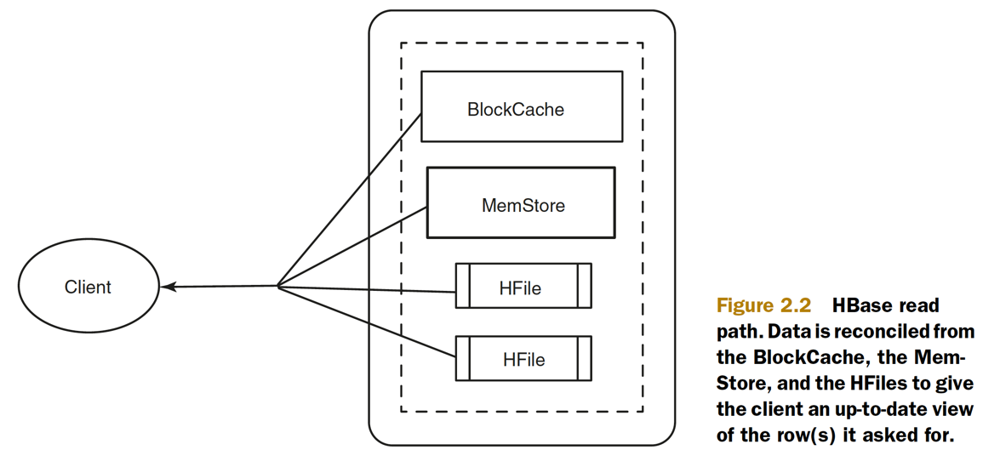
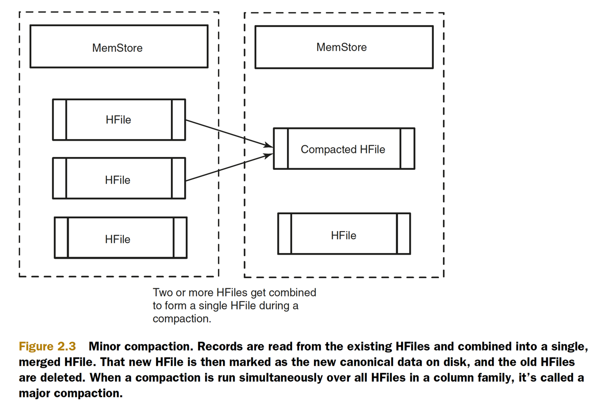
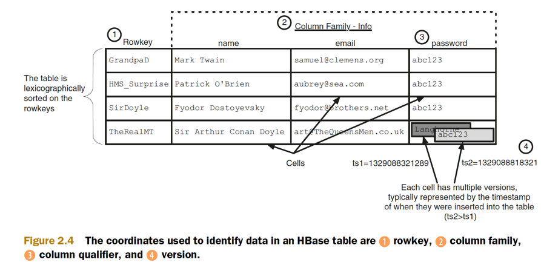
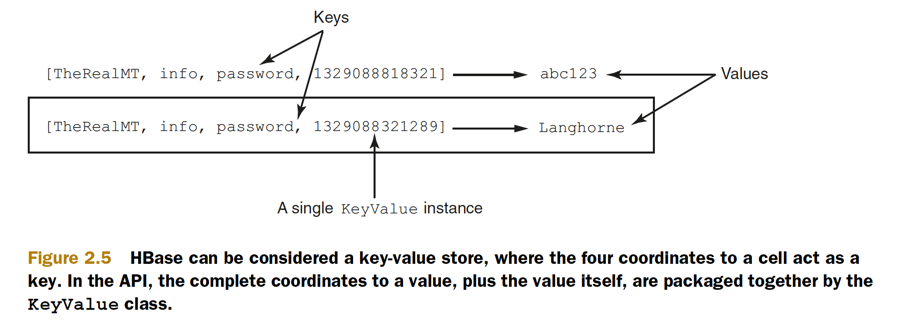
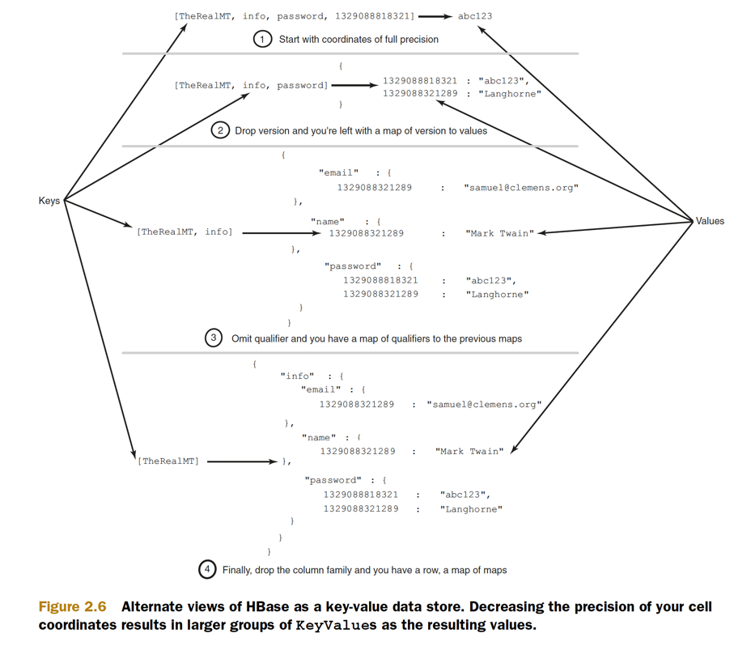
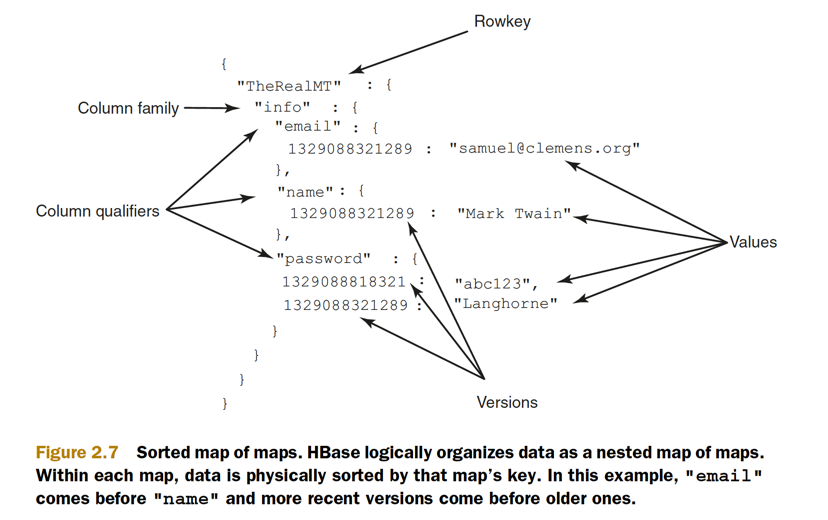
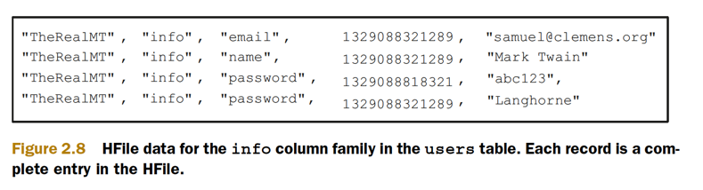
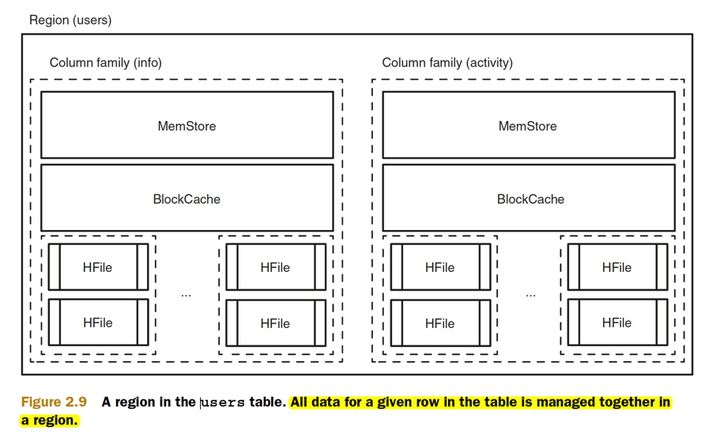

## logical data model

* Table names are Strings and composed of characters that are safe for use in a file system path.
* Rowkeys don’t have a data type and are always treated as a byte[].
* Column families also impact the physical arrangement of data stored in HBase.
* Column families also impact the physical arrangement of data stored in HBase. For this reason, they must be defined up front and aren’t easily modified. Every row in a table has the same column families, 
* Column family names are Strings and composed of characters that are safe for use in a file system path. 
* Cell—A combination of rowkey, column family, and column qualifier uniquely identifies a cell.
* Values within a cell are versioned.
* A unique data value in HBase is accessed by way of its coordinates. The complete coordinates to a value are **rowkey, column family, column qualifier, and version**


```bash
# create users table with info CF & default parameters
create 'users', 'info

hbase(main):011:0> describe 'users'
Table users is ENABLED                                                                                                                                                              
users                                                                                                                                                                               
COLUMN FAMILIES DESCRIPTION                                                                                                                                                         
{NAME => 'info', BLOOMFILTER => 'ROW', VERSIONS => '1', IN_MEMORY => 'false', KEEP_DELETED_CELLS => 'FALSE', DATA_BLOCK_ENCODING => 'NONE', TTL => 'FOREVER', COMPRESSION => 'NONE',
 MIN_VERSIONS => '0', BLOCKCACHE => 'true', BLOCKSIZE => '65536', REPLICATION_SCOPE => '0'}                                                                                         
1 row(s) in 0.0280 seconds
```

* Columns in HBase are organized into groups called column families
* A table in HBase must have at least one column family
* column families impact physical characteristics of the data store in HBase
* the table creation didn’t involve any columns or types. Other than the column family name,
* Every row in an HBase table has a unique identifier called its **rowkey**.
* rowkey values are distinct across all rows in an HBase table.
* All data in HBase is stored as raw data in the form of a byte array (`Bytes.toBytes(...)`), and that includes the rowkeys
* The rowkey is the first coordinate, followed by the column family. The next coordinate is the column qualifier, often called simply column, or qual,
* Because HBase is schema-less, you never need to predefine the column qualifiers or assign them types.
    * These three coordinates define the location of a cell. The cell is where HBase stores data as a value. A cell is identified by its `[rowkey, column family, column qualifier]` coordinate within a
      table. 
* They’re dynamic; all you need is a name that you give them at write time.
* Changing data in HBase is done the same way you store new data:

### the HBase write path

* When a write is made, by default, it goes into two places: **the write-ahead log (WAL), also referred to as the HLog, and the MemStore**
* Only after the change is written to and confirmed in both places is the write considered complete.
* The MemStore is a write buffer where HBase accumulates data in memory before a permanent write.
* Its contents are flushed to disk to form an HFile when the MemStore fills up. It doesn’t write to an existing HFile but instead forms a new file on every flush. 
* The HFile is the underlying storage format for HBase.
* HFiles belong to a column family, and a column family can have multiple HFiles.
* one MemStore per column family
* HBase safeguards against that by writing to the WAL before the write completes. Every server that’s part of the HBase cluster keeps a WAL to record changes as they happen.
* A write isn’t considered successful until the new WAL entry is successfully written
* a single WAL per HBase server, shared by all tables (and their column families) served from that server.
* replaying the WAL during the recovery process
* disable WAL write at the risk of losing data in case of RegionServer failure by `put.setWriteToWAL(false);`


### the HBase read path

* As a general rule, if you want fast access to data, keep it ordered and keep as much of it as possible in memory
* A read against HBase must be **reconciled between the persisted HFiles and the data still in the MemStore**
* HBase has an LRU cache for reads. This cache, also called the **BlockCache**, sits in the JVM heap alongside the MemStore.
* The _BlockCache is designed to keep frequently accessed data from the HFiles in memory_ so as to avoid disk reads. 
* Each column family has its own BlockCache.
* The “Block” in BlockCache is _the unit of data that HBase reads from disk in a single pass_. 
* The HFile is physically laid out as **a sequence of blocks plus an index over those blocks**
* The block is the smallest indexed unit of data and is the smallest unit of data that can be read from disk.
* If you primarily perform random lookups, you likely want a more granular block index, so a smaller block size is preferred. Having smaller blocks creates a larger index and thereby consumes more memory.
* If you frequently perform sequential scans, reading many blocks at a time, you can afford a larger block size. This allows you to save on memory
* HFiles contain a snapshot of the MemStore at the point when it was flushed.
* Data for a complete row can be stored across multiple HFiles
* HBase must read across all HFiles that might contain information for that row in order to compose the complete record.



### Commands
Get, Put, Delete, Scan, and **Increment**

## physical data model


### Compactions: HBase housekeeping

`vim visually select inner word)`
* **Delete** command writes a new “tombstone” record is written for that value, marking it as deleted.
* Because **HFiles are immutable**, it’s not until a **major compaction** runs that these tombstone records are reconciled and space is truly recovered from deleted records.
* Compactions come in two flavors: minor and major
* A minor compaction folds HFiles together, creating a larger HFile from multiple smaller HFiles,
* this process can require a lot of disk IO. What’s less clear is that it can also cause network IO.
* HBase decides which HFiles to compact based on their number and relative sizes.
* Restricting the number of HFiles is important for read performance, because all of them must be referenced to read a complete row. During the compaction, HBase reads the content of the existing HFiles, writing records into a new one.
* there is an upper limit on the number of HFiles involved



* When a compaction is run simultaneously over **all HFiles in a column family**, it’s called a major compaction.
* Major compactions are the only chance HBase has to clean up deleted records. Resolving a delete requires removing both the deleted record and the deletion marker. There’s no guarantee that both the record and marker are in the same HFile. A major compaction is the only time when HBase is guaranteed to have access to both of these entries at the same time.


### Versioned data

* being a schema-less database, HBase is also versioned
* Every time you perform an operation on a cell, HBase implicitly stores a new version. Creating, modifying, and deleting a cell are all treated identically; they’re all new versions.
* The version is used as the final coordinate when accessing a specific cell value. HBase uses the current time4 in milliseconds when a version isn’t specified
* By default, HBase stores only the last three versions; this is configurable per column family
* When a cell exceeds the maximum number of versions, the extra records are dropped during the next major compaction.


## Data coordinates



* HBase stores a piece of data in a table based on a 4D coordinate system
* The coordinates used by HBase, in order, are rowkey, column family, column qualifier, and version


* By providing decreasingly specific coordinates in your request, HBase allows you to request more data in a single operation




## Data Models

* RDBMS - These systems require strict rules around tables, columns, and data types—the **shape** of your data. Data conforming to these strict requirements is called **structured** data.
* HBase is designed for data without such a strict shape, called
  **semi-structured shape**
* HBase takes advantage of the semistructured shape of the data it stores. As systems evolve, these assumptions in the physical model influence the logical.
* In particular, HBase can’t enforce relational constraints or provide multirow transactions


### Logical model: sorted map of maps

* `Map<RowKey, Map<ColumnFamily, Map<ColumnQualifier, Map<Version, Data>>>>`
* sorted map of maps. The example shows only a single record, but even there the
  sorting is present. Notice the two versions in the password cell. The newest
  version is sorted before the later versions.
* HBase sorts the version timestamp in **descending** order so the newest data is always on top. This physical design decision results in slightly faster access to recent versions. The other map keys are sorted in ascending order.
* This sorting business turns out to be a critical consideration when designing HBase table schema in practice




### Physical model: column family oriented

* Column families are also expressed physically. 
* Each column family gets its own set of HFiles on disk. 
* This physical isolation allows the underlying HFiles of one column family to be managed in isolation of the others. 
* As far as compactions are concerned, the HFiles for each column family are managed independently 
* Records in HBase are stored in the HFiles as key-value pairs. The HFile itself is a binary file
* Notice that Mark’s row consumes multiple records in the HFile. **Each column qualifier and version gets its own record**. Also, notice there are no unused or null records.
* storage in the column family is column-oriented






* Data from a single column family for a single row need not be stored in the same HFile. Mark’s info data could be spread across any number of HFiles. The only requirement is that within an HFile, data for a row’s column family is stored together
* Using separate HFiles for each column family means HBase doesn’t need to read all the data for a row when performing a read.
* Being column- oriented means HBase need not read over placeholder entries when looking for a specific cell.
* efficient storage and fast reads of sparse datasets
* interacting with data in different column families involves completely separate MemStores and HFiles


## Table Scan

* Scan command to read across some portion of the table, applying a filter to retrieve only the relevant records
* the records returned while scanning are presented in sorted order
* e.g. Provide the Scan constructor with start and end rows 


