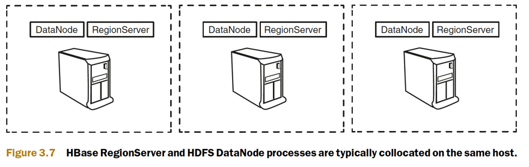
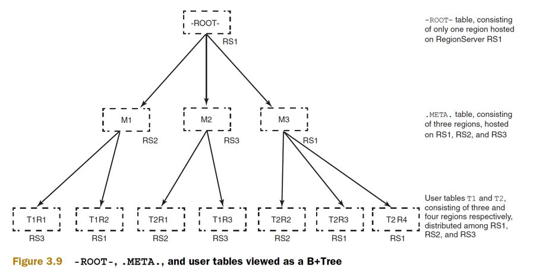
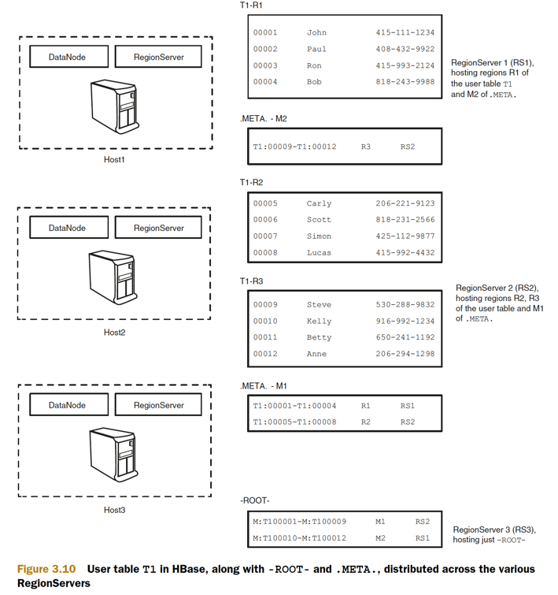
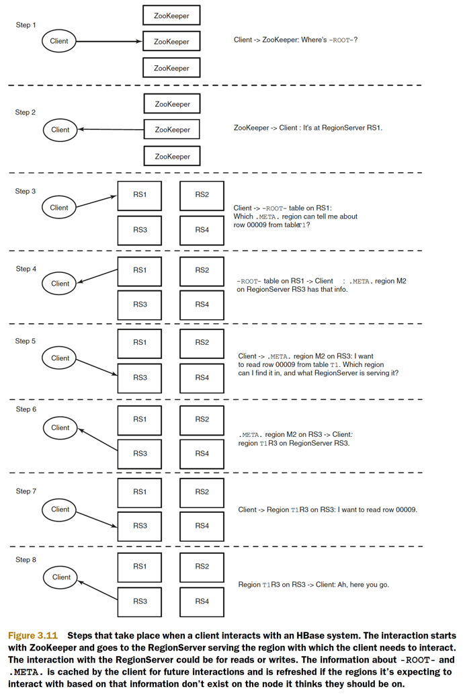
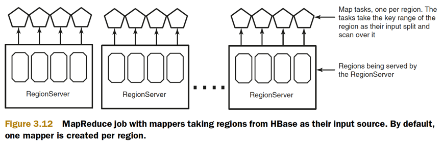
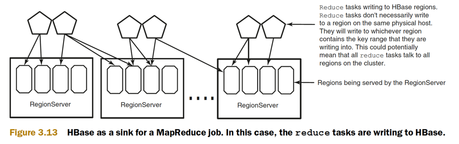
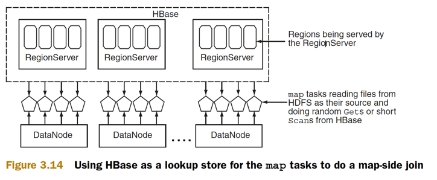
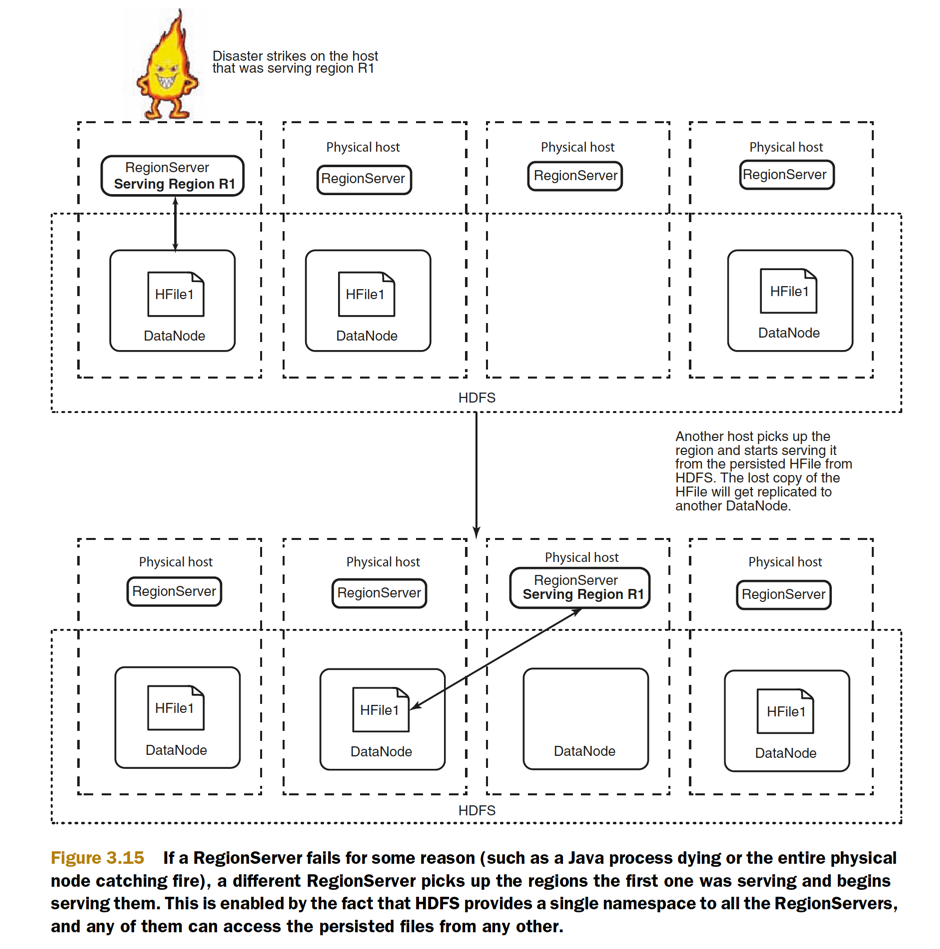

Hadoop MapReduce provides a distributed computation framework for highthroughput data access. The Hadoop Distributed File System (HDFS) gives HBase a storage layer providing availability and reliability.

## A case for MapReduce

### Online operations 

* online operations. You expect every Get and Put to return results in milliseconds 
* The twits table’s rowkey is designed to maximize physical data locality and minimize the time spent scanning records.

### Offline operations

* monthly site traffic summary report
* Offline operations have performance concerns as well. Instead of focusing on individual request latency, these concerns often focus on the **entire computation in aggregate**.

### Latency vs. throughput

* OLTP vs OLAP
* Online vs Offline
* Making the shopping list results in higher throughput
* Online systems focus on minimizing the time it takes to access one piece of data—the round trip
    * Response latency measured on the 95th percentile is generally the most important metric for online performance
    * if someone was in the 95th precentile in height they'd be taller than 95% of people and shorter than 5%. you get the idea..
* Offline systems are optimized for access in the aggregate, processing as much as we can all at once in order to maximize throughput.
    * report their performance in number of units processed per second. Those units might be requests, records, or megabytes. 
    * it’s about overall processing time of the task, not the time of an
      individual unit. 
* Serial execution has limited throughput
* Improved throughput with parallel execution


#### MapReduce: maximum throughput with distributed parallelism

* There are no split calculations, no Futures to track, and no thread pool to clean up after
* HBase provides **`TableMapper`** and **`TableReducer`** classes to help with that.


### Splitting and distributing big tables

* Tables in HBase can scale to billions of rows and millions of columns.
* These smaller chunks are called regions. Servers that host regions are called RegionServers.
* RegionServers are typically collocated with HDFS DataNodes (figure 3.7) on the same physical hardware, although that’s not a requirement. 
* The only requirement is that RegionServers should be able to access HDFS
* The master process does the distribution of regions among RegionServers, and each RegionServer typically hosts multiple regions



* By physically collocating DataNodes and RegionServers, you can use the data locality property; that is, RegionServers can theoretically read and write to the local DataNode as the primary DataNode
* Any RegionServer can host any region.
* Given that the underlying data is stored in HDFS, which is available to all clients as a single namespace, all RegionServers have access to the same persisted files in the file system and can therefore host any region


### How do I find my region

* Region assignment happens when regions split (as they grow in size), when RegionServers die, or when new RegionServers are added to the deployment
* **`-ROOT-`** never splits into more than one region. **`.META.`** behaves like all other tables and can split into as many regions as required
* Think of this like a distributed B+Tree of height 3
* The entry point for an HBase system is provided by another system called ZooKeeper




### Sample -ROOT-, .META. and User table layout




#### How client interacts with HBase




## HBase and MapReduce

* HBase can be used as a **data source** at the beginning of a job, as a **data sink** at the end of a job, or as a **shared resource** for your tasks



```java
protected void map(
    ImmutableBytesWritable rowkey,
    Result result,
    Context context) {
  //  ...
}


protected void reduce(
    ImmutableBytesWritable rowkey,
    Iterable<Put> values,
    Context context) {
//...
}
```

* They will write to whichever region contains the key range that they are writing into. 
* This could potentially mean that all reduce tasks talk to all regions on the cluster.




### Reduce-Side Join

* A reduce-side join takes advantage of the intermediate Shuffle Step to collocate relevant records from the two sets
* One big problem with the reduce-side join is that it requires all [k2,v2] tuples to be shuffled and sorted

### Map-Side Join

* Minimizing this network I/O will improve join performance. This is where the map-side join can help
* It assumes the map tasks can look up random values from one dataset while they iterate over the other
* For instance, each map task is processing a single split, which is equal to one HDFS block (typically 64–128 MB), but the join dataset that it loads into memory is 1 GB. Now, 1 GB can certainly fit in memory, but the cost involved in creating a hash-table for a 1 GB dataset for every 128 MB of data being joined makes it not such a good idea.

### MAP-SIDE JOIN WITH HBASE

* We originally described HBase as a giant hash-table
* Using HBase as a lookup store for the map tasks to do a map-side join

```python
map_timespent(line_num, line):
    users_table = HBase.connect("Users")
    userid, timespent = split(line)
    record = {"TimeSpent" : timespent}
    record = merge(record, users_table.get(userid, "info:twitcount"))
    emit(userid, ratio(record["TimeSpent"], record["info:twitcount"]))
```




### Idempotent operations

* Hadoop MapReduce assumes your map and reduce tasks are idempotent. 
* You must take care, then, when performing stateful operations, e.g. HBase’s Increment command
* Row counting
    * Instead of incrementing the counter in the mapper, a better approach is to emit ["count",1] pairs from each mapper. 


#### speculative execution

* it should be disabled if the MapReduce jobs are designed to interact with HBase.
* It is generally advisable to turn off speculative execution for MapReduce jobs that use HBase as a source. This can either be done on a per-Job basis through properties, on on the entire cluster. Especially for longer running jobs, speculative execution will create duplicate map-tasks which will double-write your data to HBase; this is probably not what you want.


----

You don’t want to run MapReduce jobs on the same cluster that serves your low-latency queries, at least not when you expect to maintain OLTP-style service-level agreements (SLAs)!

Data in HBase is partitioned and replicated like any other data in the HDFS


## Availability and reliability at scale

### AVAILABILITY

**Availability** in the context of HBase can be defined as the ability of the system to handle failures

* Any such node failure can be considered a network partition between that node and the rest of the cluster
* availability is best defined by the kind of failures a system can handle and the kind it can’t
    * ResionServer partition?
    * HMaster partition?
    * ZK partition?

Higher availability can be achieved through defensive deployment schemes. For instance, if you have multiple masters, keep them in different racks.


###  RELIABILITY AND DURABILITY

Reliability is a general term used in the context of a database system and can be thought of as a combination of data durability and performance guarantees in most cases.

### HDFS as the underlying storage

* Single namespace
    * HBase stores its data on a single file system
    * It assumes all the RegionServers have access to that file system across the entire cluster 
    * The file system exposes a single namespace to all the RegionServers in the cluster.
    * The data visible to and written by one RegionServer is available to all other RegionServers.
    



* HDFS provides HBase with a single namespace, and the DataNodes and RegionServers are collocated in most clusters. 
* Collocating these two processes helps in that RegionServers can read and write to the local DataNode, thereby saving network I/O whenever possible


### RELIABILITY AND FAILURE RESISTANCE

* HBase assumes that the data it persists on the underlying storage system will be accessible even in the face of failures
* The assumption is that the server going down won’t cause data loss on the underlying storage.
* HDFS provides certain write semantics that HBase uses to provide durability guarantees for every byte you write to it.


## Recap

* HBase is an online system driven by low latency, Hadoop is an offline system optimized for throughput.
* Individual tasks are assumed to be idempotent.
* TableMapper & TableReducer
