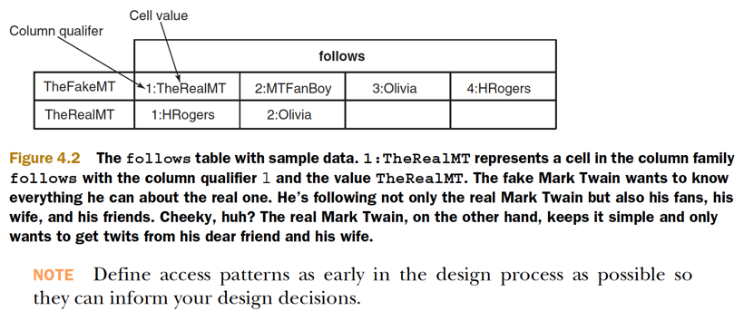
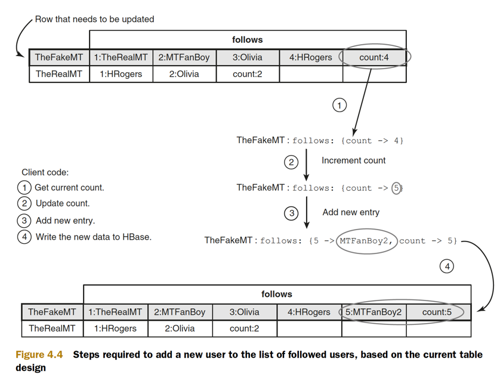
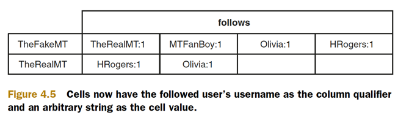
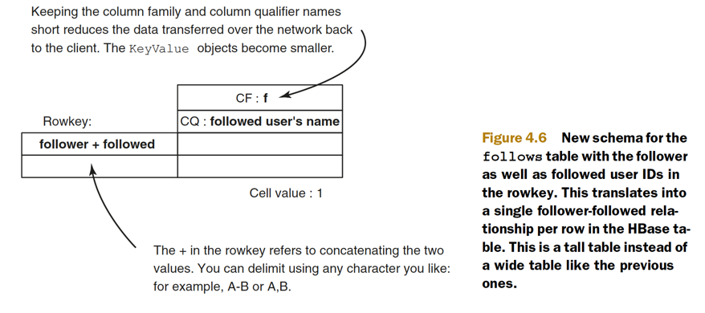
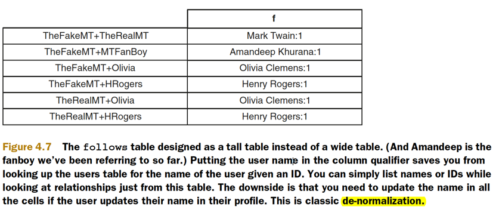
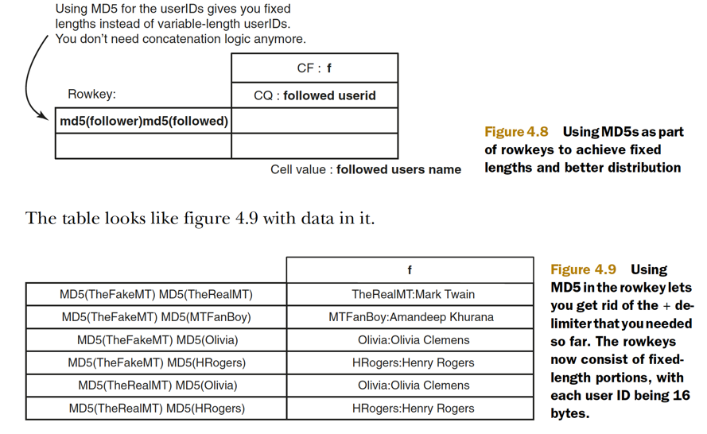

## HBase Table Design

* Sometimes we refer to HBase as schema-less as well. But the simplicity gives you the ability to tweak it in order to extract optimal performance for your application’s access patterns
* Some schemas may be great for writes, but when reading the same data back,
  they may not perform well

### Schema

* rowkey structure?
* column families?
* column names? need when write or read data
* cell data?
* versions?
* access patterns?
* physical layouts?

### Modeling for the questions

* All data for a given column family goes into a single store on HDFS. A store may consist of multiple HFiles, but ideally, on compaction, you achieve a single HFile.
* Columns in a column family are all stored together on disk, and that property can be used to isolate columns with different access patterns by putting them in different column families.
* HBase is called a column-family-oriented store.
* Define access patterns as early in the design process as possible so they can inform your design decisions.
 

### Defining requirements: more work up front always pays

* The count column gives you the ability to quickly display the number of users anyone is following. 
* keeping a count makes the client code complicated
* Given that HBase doesn’t have the concept of transactions
* it isn’t thread-safe.
* You’ll have to build logic to roll back or repeat the write operation in your client code.
* The only way you can solve this problem without making the client code complicated is to remove the counter.

* HBase stores only byte[], and you can have an arbitrary number of columns within a column family
* You put the followed user’s username in the column qualifier instead of their position on the list of followed users. The cell value now can be anything. You need something to put there because cells can’t be empty
* **Column qualifiers can be treated as data, just like values**
* The word column can be considered a misnomer. **HBase tables are multidimensional maps**.

* HBase doesn’t have the concept of cross-row transactions. Avoid designs that require transactional logic in client code

### Modeling for even distribution of data and load

* It takes three fixed operations to get to the right region—lookup ZK, lookup -ROOT-, lookup .META..
* When accessing data in HBase, the dominating factor is the time taken to scan the HFile block to get to the relevant KeyValue objects. Having wide rows increases the cost of traversing the entire row during a scan.
* The take-away is that accessing wider rows is more expensive than accessing smaller ones,

### wide table

### tall table

* Keeping to short column family names makes a difference in reducing both disk and network I/O.
* This applys to rowkeys, column qualifiers, and even cells! Store compact representations of your data to reduce I/O load.
* In HBase, accessing a single narrow row resident in the BlockCache is the fastest possible read operation
* The physical storage for both the table designs mentioned is essentially the same.

* To gain the performance benefits of a tall table, you trade off atomicity for certain operations
* Put operations at a row level are atomic
* You give up atomicity in order to gain performance benefits that come with a tall table.
* To simplify, you could de-normalize and put the username in the column qualifier, or, for that matter, in the cell in this table
* This approach makes maintaining consistency across the users table and the follows table a little challenging.
* That’s a trade-off you may or may not choose to make
* If you expect your users to change their names frequently, denormalizing may not be a good idea. We’re assuming that their names are relatively static content and de-normalizing won’t cost you much.
* De-normalize all you can without adding complexity to your client code
* In the twits table, you used MD5 as the rowkey. This gave you a fixed-length rowkey
* in the follows table, you can instead have **`MD5(userid1)MD5(userid2)`** 
* First, your rowkeys are all of consistent length, giving you more predictability in terms of read and write performance
* That’s probably not a huge win if you put a limit on the user ID length.
* Always check if any **`hot-spotting`** will happens
    * if you’re inserting time-series data, and the timestamp is at the beginning of the rowkey, you’re always appending to the bottom of the table 
    * you’ll hot-spot on the last region of the table.
* If you MD5 the timestamp and use that as the rowkey, you achieve an even distribution across all regions, but you lose the ordering in the data
* if you use MD5s in the rowkeys. By storing MD5s of the user IDs in the rowkey, you can’t get back the user IDs when you read back
    * To make the user ID accessible, you can put it into the column qualifier and the name into the cell value.

