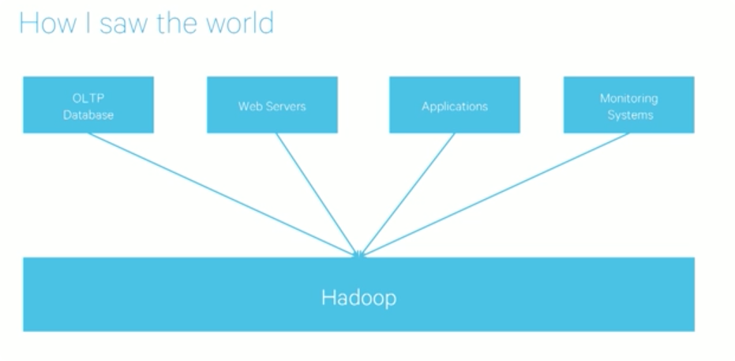
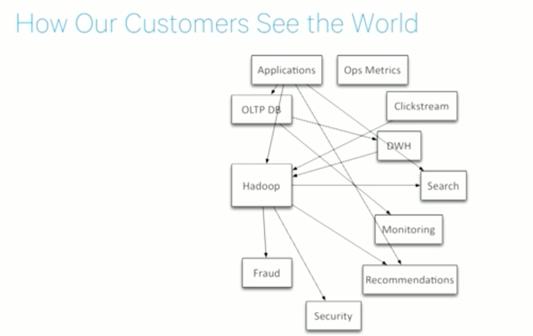
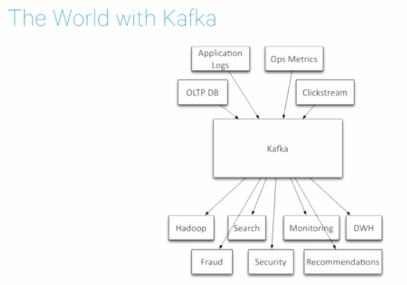
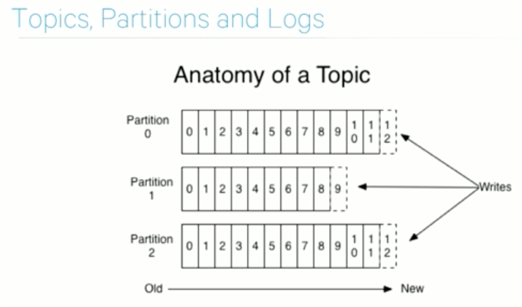
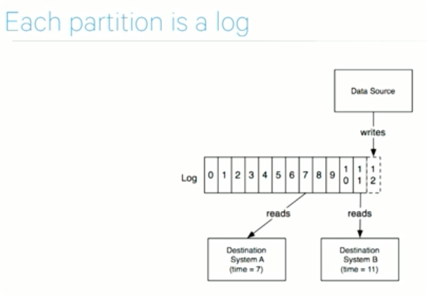
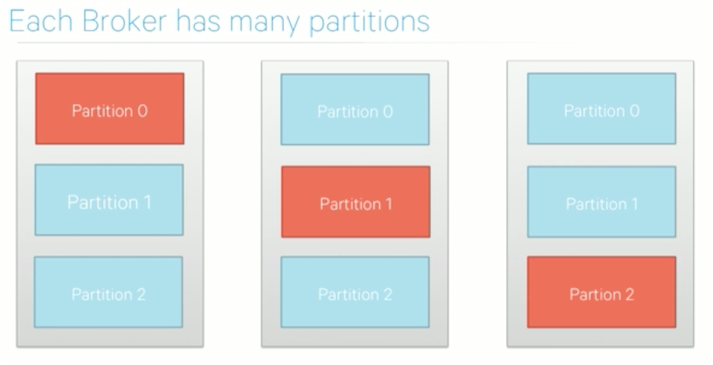
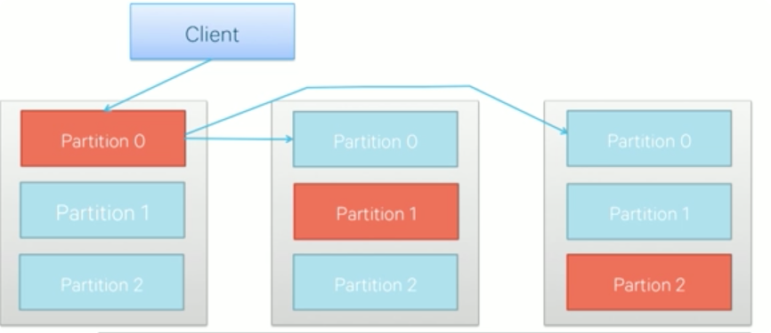
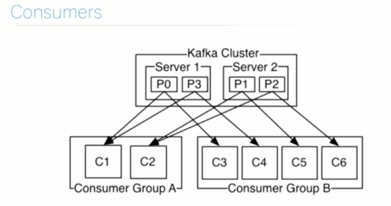

## The World with Kafka

* Kafka provides a fast, distributed, highly scalable, highly available, publish-subscribe messaging system
* In turns this solves part of a much harder problem
* Communication and integration between components of large software systems

### What's unique about Kafka?

* large number of consumers
* Ad-hoc consumers
* Batch consumers (daily/hourly jobs are ok)
* Automatic recovery from **broker** failures

### What do we do with Kafka?

* Messaging - communicating between apps
* Website Activity Tracking (clicks, searches...)
* Metrics collection - instead of writing to logs
* Audit
* Source and target stream processing

### What Kafka Doesn't Do?

* Its not end-user solution. You need to write code to use it
* Not a drop-in JMS replacement
* It doesn't have many ready-made producers and consumers
* No data transformations
* No encryption, authorization or authentication (yet)

### The Basics

* Messages are organized into **topics**
* **Producers** push messages
* **Consumers** pull messages
* Kafka runs in a cluster, Nodes are called **brokers**

`topic -> partition -> unique offset in the partition`

### Each partition as log

* Retention based on TTL 

### Each Broker has many partitions

* Producers load balance between partitions (leaders)

* Orange one is the leader, all reads and writes always goes to the leader, blues one are replications in case of leader failures
* Leader replicates to folloers

### Consumers

* Consumers in one consumer group get different set of data from brokers
* Lots of partitions allows add more consumers
* Data is replicated to different consumer groups (ML + OLAP target should belongs 2 different consumer groups)
* 