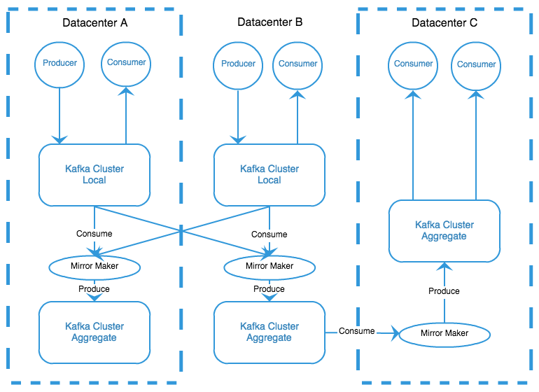
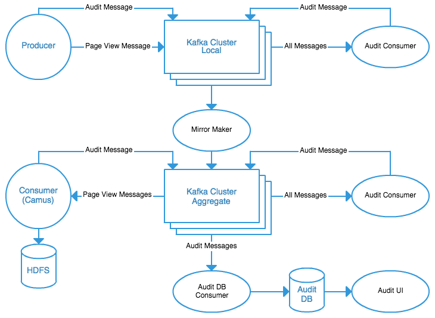
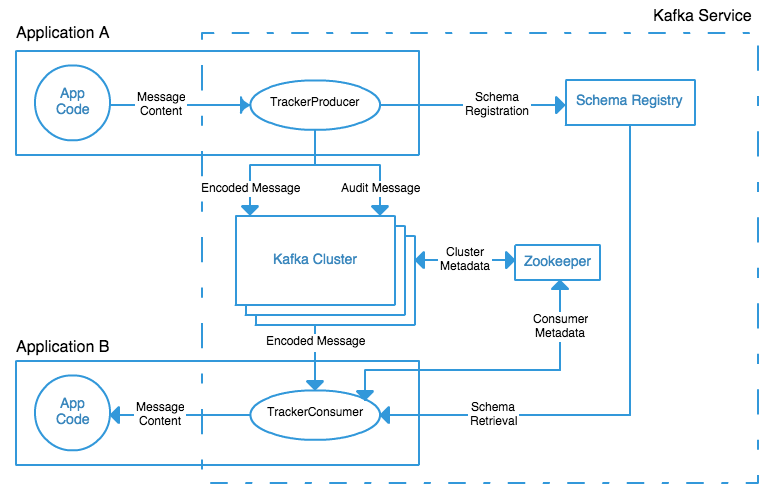
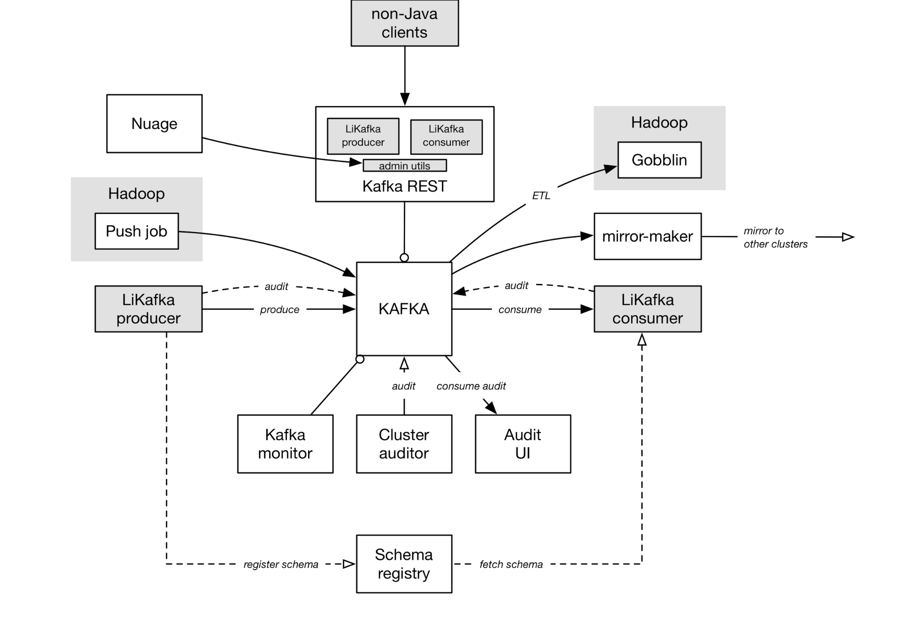

* Kafka combines queuing with message retention on disk. 
* Think of it as a commit log that is distributed over several systems in a cluster.
* Messages are organized into topics and partitions
* each topic can support multiple publishers (producers) and multiple subscribers (consumers)

Messages are retained by the Kafka cluster in a well-defined manner for each topic:

* For a specific amount of time (measured in days at LinkedIn) 
* For a specific total size of messages in a partition
* Based on a key in the message, storing only the most recent message per key

---

* Kafka itself is not concerned with the content of the messages themselves
* Data of many different types can easily coexist on the same cluster, divided into topics for each type of data.
* LinkedIn goes one step further, and defines four categories of messages: **queuing, metrics, logs and tracking data** that each live in their own cluster.
* at LinkedIn is sent over 800 billion messages per day which amounts to over 175 terabytes of data. Over 650 terabytes of messages are then consumed daily,
* the ability of Kafka to handle multiple producers and multiple consumers for each topic is important
* At the busiest times of day, we are receiving over 13 million messages per second, or 2.75 gigabytes of data per second. 
* LinkedIn runs over 1100 Kafka brokers organized into more than 60 clusters.
* by 2016, it currently handles more than 1.4 trillion messages per day across over 1400 brokers. Kafka’s strong durability and low latency 

---

* **Queuing** is the standard messaging type that most people think of. Other applications aren't interested in these messages, because they're for coordinating the actions or state of a single system
* **Metrics** handles all measurements generated by applications in their
  operation, including OS, hardware statistics to app-specific measurements. 
    * it's the eyes and ears of LinkedIn, providing visibility into the status of all servers and applications, and driving our internal monitoring and alerting systems.
* **Logging** includes application, system, and public access logs. Originally, metrics and logging coexisted on the same cluster for convenience. We now keep logging data separate simply because of how much there is.
* **Tracking** includes every action taken on the front lines of LinkedIn's infrastructure, whether by users or applications. These actions need to be communicated to other applications as well as to stream processing in Samza and batch processing in Hadoop 
    * tracking data is the most visible as it is often seen at the executive levels and is what drives revenue.
    
   >Figure 1: Layout of tiered Kafka architecture
   
   
For each message category, LinkedIn has a cluster named local containing messages created in the datacenter. There is also an aggregate cluster, which combines messages from all local clusters for a given category. We use the Kafka mirror maker application to copy messages forward, from local into aggregate.

The producer is the first tier, the local cluster (across all datacenters) is the second, and each of the aggregate clusters is an additional tier. The consumer itself is the final tier.

 In addition to monitoring the Kafka clusters and their health, we needed to create a means to assure that all messages produced are present in each of the tiers,
 
 
### Auditing Completeness
 
* Kafka Audit
 
Message schemas contain a header containing critical data common to every message, such as the message timestamp, the producing service, and the originating host. As an individual producer sends messages into Kafka, it keeps a count of how many messages it has sent during the current time interval. Periodically, it transmits that count as a message to a special auditing topic. This gives us information about how many messages each producer attempted to send into a specific topic.

 Kafka Console Auditor, consumes all messages from all topics in a single Kafka cluster. Like the producer, it periodically sends messages into the auditing topic stating how many messages it consumed from that cluster for each topic for the last time interval. By comparing these counts to the producer counts, we are able to determine that all of the messages produced actually got to Kafka.
 
 
Each Kafka cluster has its own console auditor that verifies its messages. By comparing each tier's counts against each other, we can assure that every tier has the same number of messages present.

Certain critical consumers of messages, such as the Hadoop grids, also write back auditing information as a separate tier.

This final piece provides us with end-to-end assurance that every message produced was ultimately consumed.

**`TrackerProducer`**. When the application calls it to send a message, it takes care of inserting message header fields, schema registration, as well as tracking and sending the auditing messages.

the consumer library takes care of fetching schemas from the registry and deserializing Avro messages

>Kafka as a Service at LinkedIn

---

### Core Kafka Services

Kafka Brokers
  
Kafka Mirror-Maker
mirror-maker enables us to make copies of clusters by consuming from a source cluster and producing into a target cluster

Schema Registry

* So each producer encodes Avro data, registers Avro schemas in the schema registry and embeds a schema-ID in each serialized message. 
* Consumers fetch the schema corresponding to the ID from the schema registry service in order to deserialize the Avro messages.

Kafka REST Proxy

