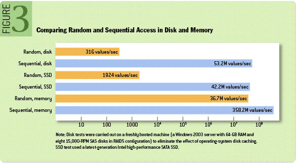
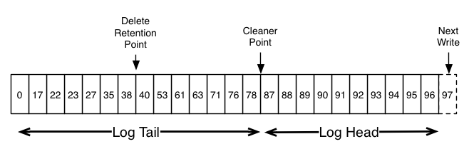
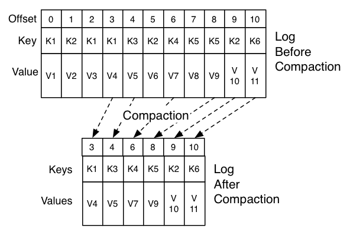

## Motivation

Kafka should be able to act as **a unified platform for handling all the real-time data feeds a large company might have**.

* high-throughput to support high volume event streams such as real-time log aggregation.
* deal gracefully with large data backlogs to be able to support periodic data loads from offline systems.
* he system would have to handle **low-latency delivery **to handle more traditional messaging use-cases.
* support partitioned, distributed, real-time processing of these feeds to create new, derived feeds.
* the system would have to be able to guarantee fault-tolerance in the presence of machine failures.

> Kafka - more akin to **a database log** than a traditional messaging system. 

## Persistence

### Don't fear the filesystem! (This style of pagecache-centric design)

* These **linear reads and writes are the most predictable of all usage patterns**, and are heavily optimized by the operating system. 
* **read-ahead and write-behind** techniques that prefetch data in large block multiples and group smaller logical writes into large physical writes.

* A modern OS will happily divert all free memory to **disk caching** with little performance penalty when the memory is reclaimed. All disk reads and writes will go through this unified cache. This feature cannot easily be turned off without using **direct I/O**, so even if a process maintains an in-process cache of the data, this data will likely be duplicated in OS pagecache, effectively storing everything twice.
* JVM overhead
    * The memory overhead of objects is very high, often doubling the size of the data stored (or worse). 
    * Java garbage collection becomes increasingly fiddly and slow as the in-heap data increases.
* As a result of these factors using the filesystem and relying on pagecache is superior to maintaining an in-memory cache or other structure, we at least double the available cache by having automatic access to all free memory, and likely double again by storing a compact byte structure rather than individual objects. 
* Doing so will result in a cache of up to 28-30GB on a 32GB machine without GC penalties.
* Furthermore this cache will stay warm even if the service is restarted, whereas the in-process cache will need to be rebuilt in memory  or else it will need to start with a completely cold cache 
*  rather than maintain as much as possible in-memory and flush it all out to the filesystem in a panic when we run out of space, we invert that. All data is immediately written to a persistent log on the filesystem without necessarily flushing to disk. In effect this just means that it is transferred into the kernel's pagecache. 

### Constant Time Suffices

* Btree operations are O(log N). Normally O(log N) is considered essentially equivalent to constant time, but this is not true for disk operations.
* Since storage systems mix very fast cached operations with very slow physical disk operations, the observed performance of tree structures is often superlinear as data increases with fixed cache
* Intuitively a persistent queue could be built on simple reads and appends to files as is commonly the case with logging solutions. 
* This structure has the advantage that all operations are O(1) and reads do not block writes or each other.
* the performance is completely decoupled from the data size
* Having access to virtually unlimited disk space without any performance penalty
* one server can now take full advantage of a number of cheap, low-rotational speed 1+TB SATA drives. Though they have poor seek performance, these drives have acceptable performance for large reads and writes and come at 1/3 the price and 3x the capacity.
* in Kafka, instead of attempting to delete messages as soon as they are consumed, we can retain messages for a relatively long period (say a week). 

### Efficiency

* handling web activity data, which is very high volume: each page view may generate dozens of writes
* we assume each message published is read by at least one consumer (often
  many), hence we strive to make consumption as cheap as possible. * 
* efficiency is a key to effective multi-tenant operations.
* Once poor disk access patterns have been eliminated, there are two common causes of inefficiency in this type of system: **too many small I/O operations, and excessive byte copying**.
* To avoid small I/O problems, our protocol is built around a "**message set" abstraction** that naturally groups messages together.
* Network requests to group messages together and amortize the overhead of the network roundtrip rather than sending a single message at a time. The server in turn appends chunks of messages to its log in one go, and the consumer fetches large linear chunks at a time.
* **Batching** leads to larger network packets, larger sequential disk operations, contiguous memory blocks, and so on, all of which allows Kafka to turn a bursty stream of random message writes into linear writes that flow to the consumers.
* To avoid byte copying issue we employ a standardized binary message format that is shared by the producer, the broker, and the consumer (so data chunks can be transferred without modification between them).
* The message log maintained by the broker is itself just a directory of files, each populated by a sequence of message sets that have been written to disk in the same format used by the producer and consumer.  
* network transfer of persistent log chunks. Modern unix operating systems offer a highly optimized code path for transferring data out of pagecache to a socket; in Linux this is done with the sendfile system call. 
* common data path to transfer data from file to socket: `os reads from disk ->
  pagecache in kernel space -> (apps reads from page cache to) user-space
  buffer -> apps writes the data back to kernel space into a socket buffer ->
  os copy tdata from socket buffer to NIC buffer`
* inefficient, there are four copies and two system calls. Using sendfile, this re-copying is avoided by allowing the OS to send the data from pagecache to the network directly. So in this optimized path, only the final copy to the NIC buffer is needed. 
* We expect a common use case to be multiple consumers on a topic. Using the **zero-copy optimization** above, **data is copied into pagecache exactly once and reused on each consumption** instead of being stored in memory and copied out to kernel space every time it is read. This allows messages to be consumed at a **rate that approaches the limit of the network connection**.
* This **combination of pagecache and sendfile** means that on a Kafka cluster where the consumers are mostly caught up you will see **no read activity on the disks whatsoever as they will be serving data entirely from cache**.
* 
### End-to-end Batch Compression

* In some cases the bottleneck is actually not CPU or disk but network bandwidth
* particularly true for a data pipeline that needs to send messages between data centers over a wide-area network.
* Efficient compression requires compressing multiple messages together rather than compressing each message individually.
* much of the redundancy is due to repetition between messages of the same type (e.g. field names in JSON or user agents in web logs or common string values) 
* Kafka supports this by allowing **recursive message sets.** A batch of messages can be clumped together compressed and sent to the server in this form. **This batch of messages will be written in compressed form and will remain compressed in the log and will only be decompressed by the consumer.**
* Kafka supports GZIP, Snappy and LZ4 compression protocols

## The Producer

###  Load balancing

* The producer sends data directly to the broker that is the leader for the partition without any intervening routing tier. To help the producer do this all Kafka nodes can answer a request for metadata about which servers are alive and where the leaders for the partitions of a topic are at any given time to allow the producer to appropriately direct its requests.
* The client controls which partition it publishes messages to. 
    * random load balancing
    * semantic partitioning function
    * user could specify a key to partition and with a hash to partition
    * if the key chosen was a user id then all data for a given user would be sent to the same partition. This in turn will allow consumers to make locality assumptions about their consumption. This style of partitioning is explicitly designed to allow locality-sensitive processing in consumers.

### Asynchronous send

* to enable batching the Kafka producer will attempt to accumulate data in memory and to send out larger batches in a single request.
*  The batching can be configured to accumulate no more than a fixed number of messages and to wait no longer than some fixed latency bound (say 64k or 10 ms). 
*  This buffering is configurable and gives a mechanism to trade off a small amount of additional latency for better throughput.

## The Consumer

The Kafka consumer works by issuing "fetch" requests to **the brokers leading the partitions it wants to consume.** The consumer **specifies its offset in the log with each request and receives back a chunk of log beginning from that position**. 

### Push vs. pull

* Kafka follows a more traditional design, shared by most messaging systems data is pushed to the broker from the producer and pulled from the broker by the consumer. 
* Some logging-centric systems, such as Scribe and A**pache Flume, follow a very different push-based path where data is pushed downstream.** 
*  a push-based system has difficulty dealing with diverse consumers as the broker controls the rate at which data is transferred. 
*  The goal is generally for the consumer to be able to consume at the maximum possible rate; 
*  a denial of service attack, in essence
* A pull-based system has the nicer property that the consumer simply falls behind and catches up when it can.
* Another advantage of a pull-based system is that it lends itself to aggressive batching of data sent to the consumer.
* The deficiency of a naive pull-based system is that if the broker has no data the consumer may end up polling in a tight loop, effectively busy-waiting for data to arrive. To avoid this we have parameters in our **pull request that allow the consumer request to block in a "long poll" waiting until data arrives**(and optionally waiting until a given number of bytes is available to ensure large transfer sizes).
* "store-and-forward" producer? not very suitable for our target use cases which have thousands of producers. involving thousands of disks in the system across many applications would not actually make things more reliable and would be a nightmare to operate
* And in practice we have found that we can run a pipeline with strong SLAs at large scale without a need for producer persistence.
* 

### Consumer Position

* Most messaging systems keep metadata about what messages have been consumed on the broker.
* getting the broker and consumer to come into agreement about what has been consumed is not a trivial problem.
* many messaging systems add an acknowledgement feature which means that messages are only marked as sent not consumed when they are sent; the broker waits for a specific acknowledgement from the consumer to record the message as consumed.
* Performance and at least once semantics!!
* Tricky problems must be dealt with, like what to do with messages that are sent but never acknowledged.
* Kafka handles this differently. Our topic is divided into a set of totally ordered partitions, each of which is consumed by one consumer at any given time. 
*  the position of a consumer in each partition is just a **single integer, the offset of the next message to consume.**
* This state can be periodically checkpointed. This makes **the equivalent of message acknowledgements very cheap** 
* A consumer can deliberately rewind back to an old offset and re-consume data. This violates the common contract of a queue 

### Offline Data Load

* Scalable persistence allows for the possibility of consumers that only periodically consume such as batch data loads that periodically bulk-load data into an offline system 
* In the case of Hadoop we parallelize the data load by splitting the load over individual map tasks, one for each node/topic/partition combination
* Hadoop provides the task management, and tasks which fail can restart without danger of duplicate data—they simply restart from their original position.

###  Message Delivery Semantics

there are multiple possible message delivery guarantees that could be provided:

* At most once—Messages may be lost but are never redelivered. 
* At least once—Messages are never lost but may be redelivered. 
* Exactly once—this is what people actually want, each message is delivered once and only once.

two problems: the durability guarantees for publishing a message and the guarantees when consuming a message.

* When publishing a message we have a notion of the message being "**committed**" to the log. Once a published message is committed it will not be lost as long as one broker that replicates the partition to which this message was written remains "**alive**".
* it is possible to allow the producer to generate a sort of "primary key" that makes retrying the produce request idempotent. Server failure? too hard to handle at which point we would guarantee the message had been published exactly once. Not supported yet
* Not all use cases require such strong guarantees. For uses which are l**atency sensitive we allow the producer to specify the durability level it desires**.

#### Consumer side semantics guarantee

So effectively Kafka guarantees at-least-once delivery by default and allows the user to implement at most once delivery by disabling retries on the producer and committing its offset prior to processing a batch of messages. Exactly-once delivery requires co-operation with the destination storage system but Kafka provides the offset which makes implementing this straight-forward.

* All replicas have the exact same log with the same offsets. The consumer controls its position in this log.
* It can read the messages, then save its position in the log, and finally process the messages => "at-most-once" semantics as in the case of a consumer failure messages may not be processed.
* It can read the messages, process the messages, and finally save its position. => "at-least-once" semantics in the case of consumer failure. **In many cases messages have a primary key and so the updates are idempotent**(receiving the same message twice just overwrites a record with another copy of itself)
* exactly once semantics => **the need to co-ordinate the consumer's position
  with what is actually stored as output** 
    * introduce a **two-phase commit** between the storage for the consumer position and the storage of the consumers output. 
    * can be handled more simply and generally by s**imply letting the consumer store its offset in the same place as its output**. when TPC is not widely supported
    * our Hadoop ETL that populates data in HDFS stores its offsets in HDFS with the data it reads so that it is guaranteed that either data and offsets are both updated or neither is.
    * require these stronger semantics and for which the messages do not have a primary key to allow for deduplication.
    
    
## Replication

* Kafka replicates the log for each topic's partitions across a configurable number of servers (you can set this replication factor on a topic-by-topic basis)
* automatic failover to these replicas
* Kafka is meant to be used with replication by default—in fact **we implement un-replicated topics as replicated topics where the replication factor is one**.
* The unit of replication is the **topic partition**. Under non-failure conditions, each partition in Kafka has a single leader and zero or more followers. 
* All reads and writes go to the leader of the partition.
* lags between leader and followers are possible
* Followers consume messages from the leader just as a normal Kafka consumer would and apply them to their own log. 
* For Kafka node **liveness** has two conditions
    * A node must be able to maintain its session with ZooKeeper (via ZooKeeper's heartbeat mechanism)
    * If it is a slave it must replicate the writes happening on the leader and not fall "too far" behind
*  The leader keeps track of the set of "in sync" nodes. ISR
*  we only attempt to handle a "fail/recover" model of failures where nodes suddenly cease working and then later recover
*   Kafka does not handle so-called "Byzantine" failures in which nodes produce arbitrary or malicious responses
* **A message is considered "committed" when all in sync replicas for that partition have applied it to their log. Only committed messages are ever given out to the consumer**.  
* **Producers, on the other hand, have the option of either waiting for the message to be committed or not, depending on their preference for tradeoff between latency and durability**
* **The guarantee that Kafka offers is that a committed message will not be lost, as long as there is at least one in sync replica alive, at all times.**
* Kafka will remain available in the presence of node failures after a **short fail-over perio**d, but may not remain available in the presence of network partitions.
   
    
## Replicated Logs: Quorums, ISRs, and State Machines (Oh my!)

* At its heart **a Kafka partition is a replicated log**
* A replicated log models the process of coming into consensus on the order of a series of values
* the simplest and fastest is with a leader who chooses the ordering of values provided to it.
* The fundamental guarantee a log replication algorithm must provide is that if we tell the client a message is committed, and the leader fails, the new leader we elect must also have that message.
* Tradeoff: if the leader waits for more followers to acknowledge a message before declaring it committed then there will be more potentially electable leaders.
* A common approach to this tradeoff is to use a majority vote for both the commit decision and the leader election.
* This majority vote approach has a very nice property: the latency is dependent on only the fastest servers. That is, if the replication factor is three, the latency is determined by the faster slave not the slower one.
* quorum algorithms more commonly appear for shared cluster configuration such as ZooKeeper but are less common for primary data storage. For example in HDFS the namenode's high-availability feature is built on a majority-vote-based journal, but this more expensive approach is not used for the data itself.

> Let's say we have 2f+1 replicas. If f+1 replicas must receive a message prior to a commit being declared by the leader, and if we elect a new leader by electing the follower with the most complete log from at least f+1 replicas, then, with no more than f failures, the leader is guaranteed to have all committed messages. This is because among any f+1 replicas, there must be at least one replica that contains all committed messages. That replica's log will be the most complete and therefore will be selected as the new leader

>This majority vote approach has a very nice property: the latency is dependent on only the fastest servers. That is, if the replication factor is three, the latency is determined by the faster slave not the slower one.

> The downside of majority vote is that it doesn't take many failures to leave you with no electable leaders

Kafka takes a slightly different approach to choosing its quorum set. Instead of majority vote, Kafka dynamically maintains a set of in-sync replicas (ISR) that are caught-up to the leader. Only members of this set are eligible for election as leader. A write to a Kafka partition is not considered committed until all in-sync replicas have received the write. This ISR set is persisted to ZooKeeper whenever it changes. 

This is an important factor for Kafka's usage model where there are many partitions and ensuring leadership balance is important. With this ISR model and f+1 replicas, a Kafka topic can tolerate f failures without losing committed messages.

* Another important design distinction is that **Kafka does not require that crashed nodes recover with all their data intact.**
* Our protocol for allowing a replica to rejoin the ISR ensures that before rejoining, it must fully re-sync again even if it lost unflushed data in its crash.

### Unclean leader election: What if they all die?

* Note that Kafka's guarantee with respect to data loss is predicated on at least one replica remaining in sync. If all the nodes replicating a partition die, this guarantee no longer holds.
* There are two behaviors that could be implemented:
  
    * Wait for a replica in the ISR to come back to life and choose this replica as the leader (hopefully it still has all its data). 
    * Choose the first replica (not necessarily in the ISR) that comes back to life as the leader.

### Availability and Durability Guarantees

* When writing to Kafka, producers can choose whether they wait for the message to be acknowledged by 0,1 or all (-1) replicas.
* By default, when acks=all, acknowledgement happens as soon as all the current in-sync replicas have received the message.

### Replica Management

* balance partitions within a cluster in a round-robin fashion to avoid clustering all partitions for high-volume topics on a small number of nodes. 
* Likewise we try to balance leadership so that each node is the leader for a proportional share of its partitions.
*  A naive implementation of leader election would end up running an election per partition for all partitions a node hosted when that node failed. Instead, we elect one of the brokers as the "controller". This controller detects failures at the broker level
*  batch together many of the required leadership change notifications which makes the election process far cheaper and faster for a large number of partitions
  
 
## Log Compaction

* Log compaction ensures that Kafka will always retain at least the last known value for each message key within the log of data for a single topic partition.
* data retention where old log data is discarded after a fixed period of time or when the log reaches some predetermined size => works well for temporal event data such as logging where each record stands alone.
* an important class of data streams are the log of changes to keyed, mutable data
* Say we have a topic containing user email addresses; every time a user updates their email address we send a message to this topic using their user id as the primary key.
* Log compaction gives us a more granular retention mechanism so that we are guaranteed to retain at least the last update for each primary key
* we guarantee that the log contains a full snapshot of the final value for every key not just keys that changed recently.
* Log compaction is a mechanism to give finer-grained per-record retention, rather than the coarser-grained time-based retention. The idea is to selectively remove records where we have a more recent update with the same primary key. This way the log is guaranteed to have at least the last state for each key.
* Kafka acts as a source-of-truth store so it is useful even in situations where the upstream data source would not otherwise be replayable.

The head of the log is identical to a traditional Kafka log. It has dense, sequential offsets and retains all messages. Log compaction adds an option for handling the tail of the log. The picture above shows a log with a compacted tail.

* the messages in the tail of the log retain the original offset assigned when they were first written—that never changes.
* this position is indistinguishable from the next highest offset that does appear in the log.
* Compaction also allows for deletes. A message with **a key and a null payload** will be treated as a delete from the log. 
* The compaction is done in the background by periodically **recopying log segments**. Cleaning does not block reads and can be **throttled**

Log compaction guarantees the following:

* Ordering of messages is always maintained
* The offset for a message never changes.
* Any read progressing from offset 0 will see at least the final state of all records in the order they were written

#### Log Compaction Details

Log compaction is handled by the log cleaner, a pool of background threads that recopy log segment files, removing records whose key appears in the head of the log.

### Quotas

* Quotas are basically byte-rate thresholds defined per client-id.
* 

