## Guarantees

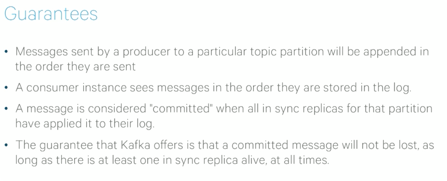

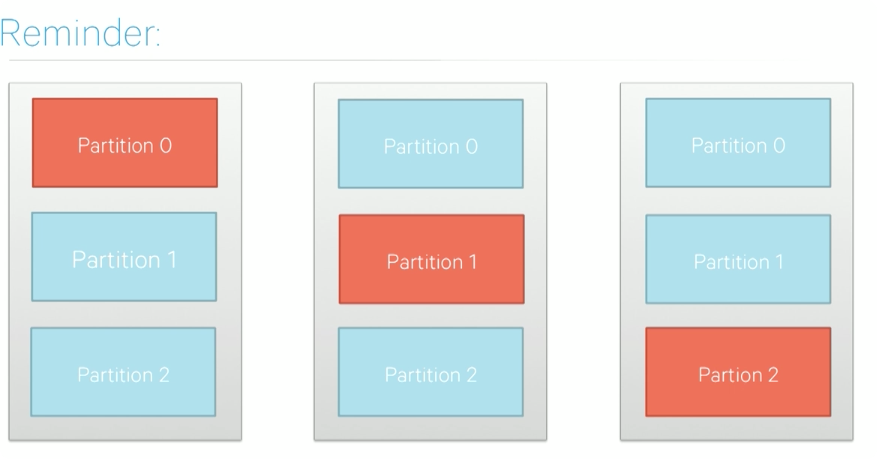

* replicas are pulling messages from leader

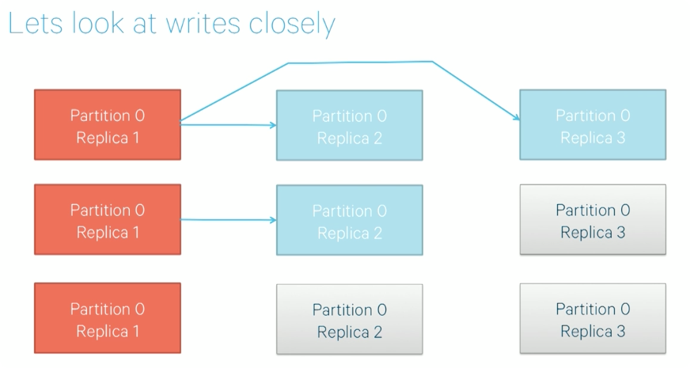

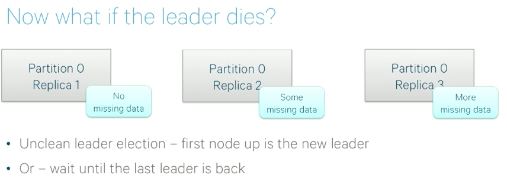

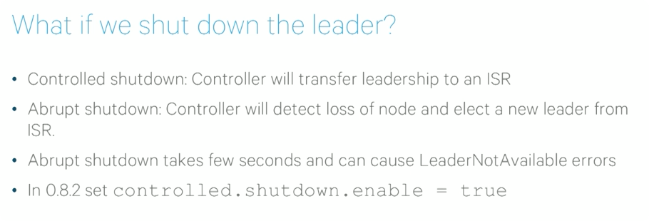

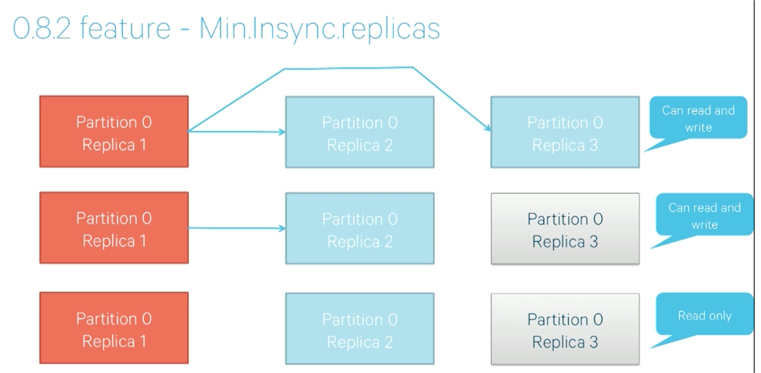

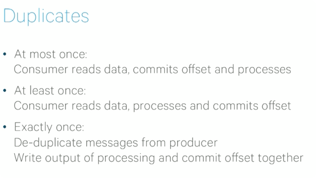

* write processing output and commit offset at one place, failure or success as
  a whole

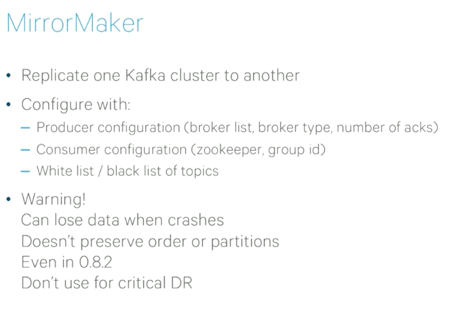

## Kafka Ecosystem

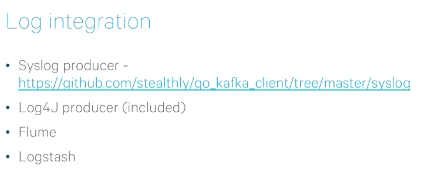

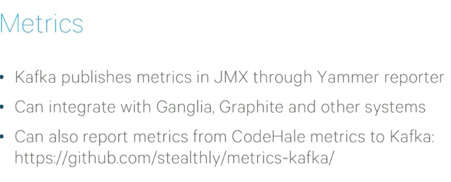

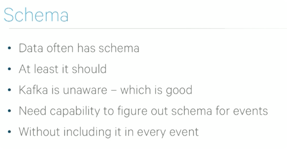

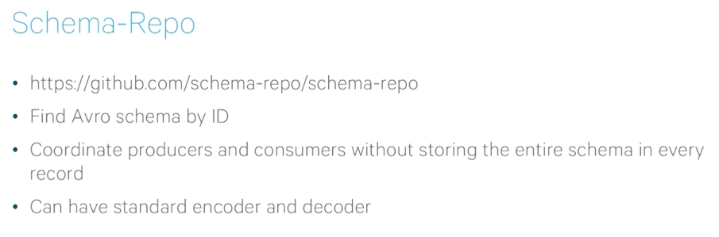

### kafkacait

    brew install kafkacat
    
   
### Furture

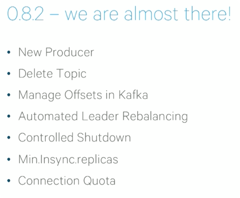

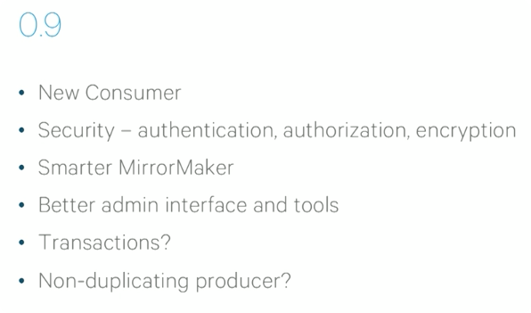