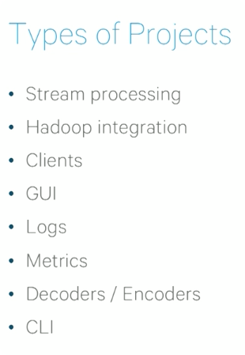

## Guarantees

* replicas are pulling messages from leader

* write processing output and commit offset at one place, failure or success as
  a whole

## Kafka Ecosystem

### kafkacait

    brew install kafkacat
    
   
### Furture

