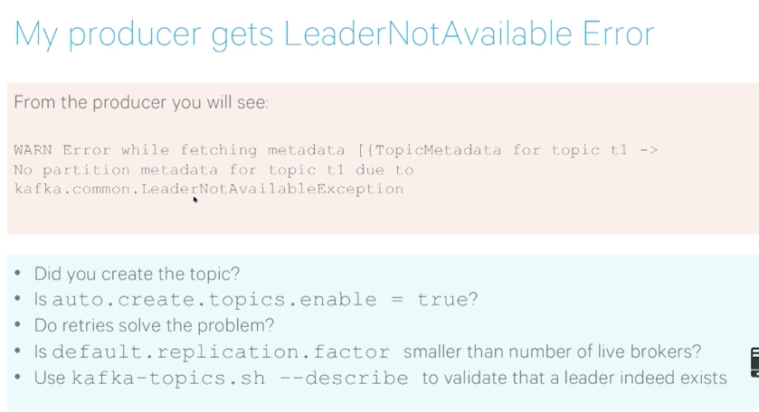

* --broker.list could be partial, but should be at least 3
* ip binding, one machine may have multiple ips!

* topic auto created enabled?

* false alert
* producer very large batch? => lag is natural
* msg max size?
* replica is smoe kind of consumer, follower fetch messages from leader

* 10 minutes => close message should be more like, and good compression, good effciency
* generate one random key
* use custom random partitioner
* set the topic refresh interval lower

###  Should I use SSDs for my Kafka Brokers? Using SSDs instead of spinning disks
It has not been shown to provide a significant performance improvement for
Kafka, for two main reasons:

**Kafka writes to disk are asynchronous**. That is, other than at startup/shutdown, no Kafka operation waits for a disk sync to complete; disk syncs are always in the background. That’s why replicating to at least three replicas is critical—because a single replica will lose the data that has not been sync’d to disk, if it crashes.
**Each Kafka Partition is stored as a sequential write ahead log**. Thus, disk reads and writes in Kafka are sequential, with very few random seeks. **Sequential reads and writes are heavily optimized by modern operating systems**.

### Is it true that Apache ZooKeeper can become a pain point with a Kafka cluster?
Starting with version 0.8.2, the high-level consumer can use Kafka itself to manage offsets. Essentially, it uses a separate Kafka topic to manage recently read offsets, and thus Zookeeper is no longer required for offset management. However, users get to choose whether they want offsets managed in Kafka or ZooKeeper, via the consumer config parameter offsets.storage.

Cloudera highly recommends using Kafka to store offsets. However, you may choose to use ZooKeeper to store offsets for backwards compatibility

### Does Kafka support cross-data center availability?

* cross-data center availability with Kafka is via **MirrorMaker**. Set up a Kafka cluster in each of your data centers, and use MirrorMaker to do near real-time replication of data between the Kafka clusters. 
* An architectural pattern while using MirrorMaker is to have one topic per Data-Center (DC) for each “logical” topic
*  if you want a topic for “clicks” you’ll have “DC1.clicks” and “DC2.clicks”
   (where DC1 and DC2 are your data centers). DC1 will write to DC1.clicks and
   DC2 to DC2.clicks. MirrorMaker will replicate all DC1 topics to DC2 and all
   DC2 topics to DC1. Now the application on each DC will have access to events
   written from both DCs. It is up to the application to merge the information
   and handle conflicts accordingly.

### What type of data transformations are supported on Kafka?

* Kafka does not enable transformation of data as it flows through Kafka.
* To perform data transformation
    *  For simple event by event processing, use the Flume Kafka integration, and write a simple Apache Flume Interceptor
    *  For complex processing, use Apache Spark Streaming to read from Kafka and process the data
* In either case, the transformed/processed data can be written back to a new Kafka topic (which is useful if there are multiple downstream consumers of the transformed data), or directly delivered to the end consumer of the data.

### How to send large messages or payloads through Kafka?

* Cloudera benchmarks indicate that Kafka reaches **maximum throughput with message sizes of around 10KB.** Larger messages will show decreased throughput
* If the message payload sizes will be in the order of 100s of MB, we recommend exploring the following alternatives:
  
>If shared storage is available (HDFS, S3, NAS), place the large payload on shared storage and **use Kafka just to send a message with the payload location**. Handle large messages by chopping them into smaller parts before writing into Kafka, **using a message key to make sure all the parts are written to the same partition** so that they are consumed by the same Consumer, and re-assembling the large message from its parts when consuming.

* While sending large messages through Kafka, keep the following in mind:
    *  **Kafka Producers can compress messages.** Ensure compression is turned
       on via the config parameter compression.codec. Valid options are “gzip”
       and “snappy”.
    *  message.max.bytes (default:1000000): maximum size of a message the broker will accept. Increase this value to accommodate your largest message.
    *  log.segment.bytes (default: 1GB): size of a Kafka data file. Make sure it’s larger than one message. Default should be fine since large messages should not exceed 1GB in size. 
    *  replica.fetch.max.bytes (default: 1MB): maximum size of data that a broker can replicate. This has to be larger than message.max.bytes, or a broker will accept messages and fail to replicate them, leading to potential data loss.
    *  Consumer configs: fetch.message.max.bytes (default **1MB**) – Maximum size of message a consumer can read. This should be greater than or equal to message.max.bytes configuration on the broker.
* A few other considerations:
    *  Brokers will need to allocate a buffer of size replica.fetch.max.bytes for each partition they replicate. Do the math and make sure the number of partitions * the size of the largest message does not exceed available
       memory, or you’ll see OOMs. 
    *  Same for consumers and fetch.message.max.bytes: Confirm there’s enough memory for the largest message for each partition the consumer reads. 
    *  Large messages may cause longer garbage collection pauses (as brokers need to allocate large chunks). Keep an eye on the GC log and on the server log. **If long GC pauses cause Kafka to lose the ZooKeeper session, you may need to configure longer timeout values for zookeeper.session.timeout.ms**.
