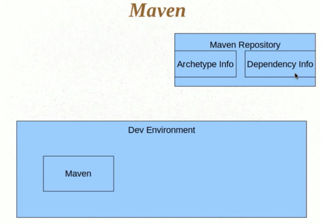
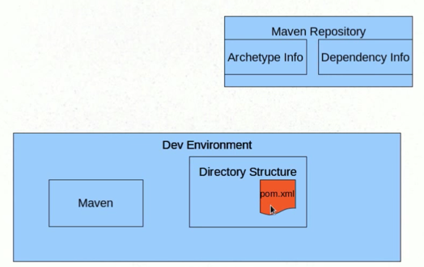
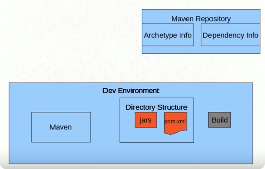

## Maven

* Build tool
* Project management tool

## Common problems and activites

* Multiple jars
    * include all spring jars to my proj? both at compile time and distribution bundle time
    * what are these jars?
* Dependencies and version
    * all dependent jars?
    * matching the right versions?
* Project structure
    * web app?
* Building, publishing and deploying

```bash
wget ...mavrn dist
export M2_HOME=...
export PATH=$(PATH):...

mvn --version

# iteractive mode
mvn archetype:generate

# batch mode
mvn archetype:generate -DgroupId=com.mycompany.app -DartifactId=my-app -DarchetypeArtifactId=maven-archetype-quickstart -DinteractiveMode=false

```
* You executed the Maven **goal** archetype:generate, and passed in various parameters to that goal (something like task). The prefix archetype is the **plugin** that contains the goal 
* a plugin is a collection of goals with a general common purpose


------
The pom.xml file is the project's **Project Object Model**, or POM

* group id (like package name, which org the artifact belongs to)
* artifact id  (like app name)
* version (1.0-SNAPSHOT by default)

No need to worry about indirect dependencies of direct dependency in pom, maven will handle that for us

```bash
# compile to classes file
mvn compile
# wait for dependencies to be downloaded


# package to jar
mvn package
# this will automatically run tests

java -cp target/classes net.zhenglai.zk.CreateGroup
or 
java -cp target/hadoop-arch.jar net.zhenglai.zk.CreateGroup
```

* `package` is not 2 words, rather than a goal, this is a **phase**. A phase is a step in the **build lifecycle**, which is an ordered sequence of phases.
* When a phase is given, Maven will execute every phase in the sequence up to and including the one defined. 
* f we execute the **compile phase**, the phases that actually get executed are:
    1. validate
    2. generate-sources
    3. process-sources
    4. generate-resources
    5. process-resources
    6. compile

These are the most common default lifecycle phases executed.

* **validate**: validate the project is correct and all necessary information is available
* **compile**: compile the source code of the project
* **test**: test the compiled source code using a suitable unit testing framework. These tests should not require the code be packaged or deployed
* **package**: take the compiled code and package it in its distributable format, such as a JAR.
* **integration-test**: process and deploy the package if necessary into an environment where integration tests can be run
* **verify**: run any checks to verify the package is valid and meets quality criteria
* **install**: install the package into the local repository, for use as a dependency in other projects locally
* **deploy**: done in an integration or release environment, copies the final package to the remote repository for sharing with other developers and projects.
 
There are two other Maven lifecycles of note beyond the default list above. They are

* **clean**: cleans up artifacts created by prior builds
* **site**: generates site documentation for this project

Phases are actually mapped to underlying goals.** The specific goals executed per phase is dependant upon the packaging type of the project.** For example, package executes `jar:jar` if the project type is a JAR, and `war:war` if the project type is - you guessed it - a WAR.

An interesting thing to note is that phases and goals may be executed in sequence.
    `mvn clean dependency:copy-dependencies package`

`mvn site` phase generates a site based upon information on the project's pom. You can look at the documentation generated under target/site



by default, only JUnit dependency is included in pom.xml


Finally, we could start building


## Archetypes and pom.xml

* Project template
    * Maven archetype
    * Folder structure
    * pom.xml
        * Maven co-ordinates
        * Metadata
        * Build information
        * Resources and dependencies
* Build

`archetype:generate`

* Archetype
* Group ID
* Artifact ID
* Version
* Package
