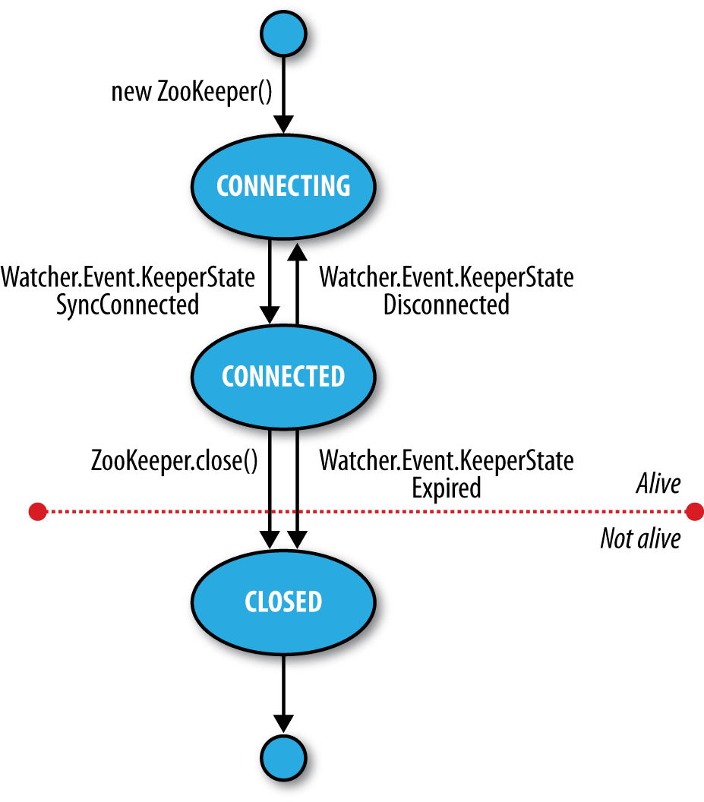

# The ZooKeeper Coordination Service

## Data Model

* ZooKeeper maintains a hierarchical tree of nodes called **znodes**. 
* A znode stores **data** and has an associated **ACL**.
* there is a limit of **1 MB** on the amount of data that may be stored in any znode

* Data access is atomic.
* client reading the data stored in a znode will never receive only some of the data;
    * either the data will be delivered in its entirety 
    * or the read will fail
* a write will replace all the data associated with a znode. 
    * ZooKeeper guarantees that the write will either succeed or fail;
* ZooKeeper does not support an append operation.
* Znodes are referenced by paths
* Paths are canonical
    * In ZooKeeper, “.” does not have this special meaning and is actually illegal as a path component
    
### Ephemeral znodes

* uses ephemeral znodes to implement a group membership service

### Sequence numbers

* Sequence numbers can be used to impose a global ordering on events in a distributed system and may be used by the client to infer the ordering
* use sequential znodes to build a shared lock

### Watches

* Watches allow clients to get notifications when a znode changes in some way
* Watchers are triggered only once
* We can build a configuration service to demonstrate how to use watches to update configuration across a cluster

### Operations

* A delete or setData operation has to specify the version number of the znode that is being updated (which is found from a previous exists call)
* Updates are a nonblocking operation
* ZooKeeper can be viewed as a filesystem, files are small and are written and read in their entirety, there is no need to provide open, close, or seek operations
* writes in ZooKeeper are atomic, and a successful write operation is guaranteed to have been written to persistent storage on a majority of ZooKeeper servers. 
* However, it is permissible for reads to lag the latest state of the ZooKeeper service, and the `sync` operation exists to allow a client to bring itself up to date.

### Multiupdate

* `multi`, that batches together multiple primitive operations into a single unit that either succeeds or fails in its entirety.
* maintain some global invariant

### Watch triggers

* The read operations exists, getChildren, and getData may have watches set on them,
* the watches are triggered by write operations: create, delete, and setData. 
* ACL operations do not participate in watches

### ACLs

Clients may authenticate themselves after establishing a ZooKeeper session

* digest    (username + password)
* sasl      (kerberos)
    `zk.addAuthInfo("digest", "tom:secret".getBytes());`
* ip

### Implementation

* standalone mode
* replicated mode
    * ensemble
    * achieve HA through replication
    * majority
    * it is usual to have an odd number of machines in an ensemble.
* all ZK has to do is ensure that every modification to the tree of znodes is replicated to a majority of the ensemble 
* If a minority of the machines fail, then a minimum of one machine will survive with the latest state. The other remaining replicas will eventually catch up with this state.
* Zab Protocol
    * Phase 1: Leader election 
        * leaders 
        * followers 
        * This phase is finished once a majority (or quorum) of followers have synchronized their state with the leader.
    * Phase 2: Atomic broadcast
* If the leader fails, the remaining machines hold another leader election.
* Leader election is very fast, around 200ms
* All machines in the ensemble write updates to disk before updating their in-memory copies of the znode tree. 
* Read requests may be serviced from any machine, and because they involve only a lookup from memory, they are very fast.

* Reads are satisfied by followers, whereas writes are committed by the leader
* A follower may lag the leader by a number of updates

### Constiency

* Every update made to the znode tree is given a globally unique identifier, called a `zxid`
* Updates are ordered, so if zxid z1 is less than z2, then z1 happened before z2, according to ZooKeeper (which is the single authority on ordering in the distributed system).

----
- Sequential consistency
    - Updates from any particular client are applied in the order that they are sent 
- Atomicity
    - Updates either succeed or fail   
- Single system image
    - A client will see the same view of the system
    - a server that is behind the one that failed will not accept connections from the client until it has caught up with the failed server. 
- Durability
    - Updates will survive server failures 
- Timeliness
    - The lag in any client’s view of the system is bounded 
    - rather than allow a client to see data that is very stale, a server will shut down, forcing the client to switch to a more up-to-date server.
- For performance reasons, reads are satisfied from a ZooKeeper server’s memory and do not participate in the global ordering of writes
    - the `sync` operation is available only as an asynchronous call. This is because you don’t need to wait for it to return, since ZooKeeper guarantees that any subsequent operation will happen after the sync completes on the server 

### Sessions

* A ZooKeeper client is configured with the list of servers in the ensemble. until it either successfully connects to one of them or fails
* Once a connection has been made with a ZooKeeper server, the server creates a new session for the client. A session has a timeout period that is decided on by the application that creates it.
* Sessions are kept alive by the client sending ping requests (also known as heartbeats) whenever the session is idle for longer than a certain period
* The period is chosen to be low enough to detect server failure (manifested by a read timeout) and reconnect to another server within the session timeout period.

Failover to another ZooKeeper server is handled automatically by the ZooKeeper client,
and crucially, sessions (and associated ephemeral znodes) are still valid after another
server takes over from the failed one.

During failover, the application will receive notifications of disconnections and connections
to the service. Watch notifications will not be delivered while the client is
disconnected, but they will be delivered when the client successfully reconnects. Also,
if the application tries to perform an operation while the client is reconnecting to another
server, the operation will fail. This underlines the importance of handling connection
loss exceptions in real-world ZooKeeper applications

### Time

#### tick time

* The session timeout, for example, may not be less than 2 ticks or more than 20.
* A low session timeout leads to faster detection of machine failure.
* Beware of setting the session timeout too low, however, because a busy network can cause packets to be delayed and may cause inadvertent session expiry
* it is possible to design the application so it can restart within the session timeout period and avoid session expiry. 
* Applications that create more complex ephemeral state should favor longer session timeouts, as the cost of reconstruction is higher. In some cases, it is possible to design the application so it can restart within the session timeout period and avoid session expiry. (This might be desirable to perform maintenance or upgrades.) Every session is given a unique identity and password by the server
* As a general rule, the larger the ZooKeeper ensemble, the larger the session timeout should be

### States
The ZooKeeper object transitions through different states in its lifecycle
`public States getState()`

* Despite the enum’s name, an instance of ZooKeeper may be in only one state at a time

A ZooKeeper Watcher object serves double duty: it can be used to be notified of changes in the ZooKeeper state (as described in this section), and it can be used to be notified of changes in znodes